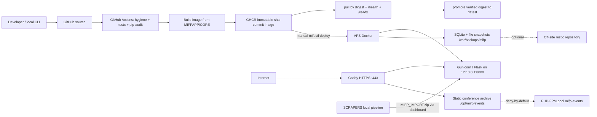

# MIFP Production Security Audit

**Repository:** `MifpWebNew`
**Audit date:** 2026-09-18
**Scope owner:** autonomous production refactor & hardening task
**Method:** manual code-path tracing, executable reproductions against the real
modules, static analysis (`ruff`, `bandit`), dependency audit (`pip-audit`),
repository/history inspection, Docker image build + inspection + runtime smoke
test, CI/CD and infrastructure-as-code review.

---

## Executive Summary

**Baseline posture before this task: MODERATE RISK.**
**Posture after the fixes applied in this task: WELL HARDENED WITH MINOR FINDINGS.**

No **CRITICAL** vulnerability was found. There is no unauthenticated remote code
execution, no unauthenticated disclosure of the database, and no path from a
public request to a shell or to arbitrary SQL. The application ships with a
genuinely strong control set: a read-only, non-root, capability-dropped
container on a loopback-only port; a deny-by-default PHP vhost; a per-request
nonce-based CSP and full security-header set; SQLite everywhere parameterized
behind identifier allowlists; SSRF validation with per-hop DNS pinning; and a
validated, integrity-checked backup/restore path.

Three **HIGH** findings were confirmed. None of them were reachable by an
anonymous Internet user:

| ID | Severity | What it allowed | Reachability | Status |
| --- | --- | --- | --- | --- |
| `MIFP-ZIP-001` | HIGH | Import of a crafted JSONL/ZIP record copied **any readable local file** into the public asset library, then served it unauthenticated at `/media/…` | Authenticated admin imports an untrusted/LLM-generated package | **FIXED** |
| `MIFP-ZIP-002` | HIGH | A `mifp-content` package could install unsigned durable state (settings, roles, join requests, slug redirects), including forcing maintenance mode | Same | **FIXED** |
| `MIFP-CI-001` | HIGH | Weekly GHCR prune deleted **every** image version including the one carrying `latest`, breaking `mifpctl init`, `deploy` and registry rollback | Unattended scheduled workflow | **FIXED** |

A **second hardening round** was performed afterwards, before a VPS existed.
It confirmed three further **HIGH** findings — none exploitable by an anonymous
Internet user — and fixed all three: SSH hardening was neither automated nor
verified while `security-check` falsely reported success (`MIFP-SSH-001`); the
host had no security-update automation or reboot policy (`MIFP-UPD-001`); and
`restore-snapshot` could rotate away the very snapshot being restored and then
abort *after* stopping the service (`MIFP-BK-001`). It also closed the previous
round's open CSRF, rate-limit, data-quality and archive items, scanned the full
Git history with a dedicated secret scanner (clean), pinned every CI action to a
commit SHA, added a secret-scan and an image-CVE gate in front of `latest`
promotion, and produced a clean-VPS runbook. See **PRE-DEPLOYMENT READINESS**
for the full matrix. **The current posture is READY TO DEPLOY SAFELY — it is not
LIVE-PRODUCTION VERIFIED, because no VPS exists.**

The two application HIGH findings both sit behind the admin login, which is why
the baseline is *moderate* rather than *high risk*: they are real and
consequential, but they require a privileged action that is itself the intended
trust boundary. `MIFP-CI-001` is the most operationally dangerous item found
because it is deterministic and unattended, and because the damage (an emptied
container registry) is not recoverable from the repository.

Two **MEDIUM** findings were also confirmed and fixed (an SSRF validation gap
on legacy numeric IP notations, and a `state.json`/integrity issue in the asset
importer), together with a set of **LOW** findings that were almost all
silent-failure and logging problems rather than exploitable defects.

Everything that remains open is either an operator/GitHub-side action
(SSH hardening automation, action SHA pinning, image CVE scanning) or a
deliberate, documented design trade-off. Section *Remediation Summary*
separates these explicitly.

**Honest limitation:** no live VPS was reachable from this environment. All
infrastructure conclusions are derived from infrastructure-as-code and the
operator tooling; a read-only production verification checklist is provided in
*Residual Risks* instead of invented live results.

---

## Scope

### Inspected

| Area | Artifacts |
| --- | --- |
| Application runtime | `MIFPAPP/CORE/mifp_app/**` — app factory, config, blueprints, services, utilities |
| Database layer | `mifp_app/db/**` (connection, contract, migrations, runtime check, schema), SQLite usage across services |
| Imports / exports | `services/importers.py`, `services/data_portability.py`, `services/portability_contract.py`, `services/exporters.py` |
| Archive handling | `services/asset_cleanup.py`, `services/historical_archive.py`, `services/conference_packages.py`, `services/conference_sites.py` |
| Remote assets | `services/assets.py`, `services/download_jobs.py`, `services/asset_cleanup.py` (SSRF, size/redirect/timeout handling) |
| Authentication / admin | `routes/auth.py`, `utils/security.py`, `manage.py`, `deploy/configure.py`, session/CSRF hardening in `mifp_app/__init__.py` |
| Filesystem handling | `runtime_storage.py`, `utils/file_safety.py`, `services/admin_safety.py`, `services/operation_maintenance.py` |
| HTTP security | Security headers, CSP nonce, Trusted Hosts, ProxyFix, cookie flags, error handlers in `mifp_app/__init__.py` |
| Docker | `MIFPAPP/CORE/Dockerfile`, `.dockerignore`, `docker-entrypoint.sh`, `gunicorn_conf.py`, `requirements*.txt`, `pyproject.toml` |
| Dependencies | `MIFPAPP/CORE/requirements.lock`, `SCRAPERS/requirements.txt`, `MIFPAPP/DATABASE/requirements.txt` |
| Git repository | `.gitignore`, `.dockerignore`, `.gitattributes`, `tools/check_repo_hygiene.py`, tracked file inventory, commit history (`git log`, `git ls-files`) |
| CI/CD | `.github/workflows/ci-cd.yml`, `.github/workflows/ghcr-cleanup.yml` |
| Caddy / TLS | `deploy/Caddyfile` |
| PHP conference archive | `deploy/Caddyfile` PHP rules, `deploy/bootstrap-vps.sh` pool setup, `deploy/deploy.sh` allow-list management |
| Deployment tooling | `deploy/deploy.sh`, `deploy/mifpctl`, `deploy/bootstrap-vps.sh`, `deploy/vps_config.py`, `deploy/configure.py`, `deploy/compose.production.yaml`, `deploy/backup.sh`, `deploy/mifp-backup.{service,timer}`, `deploy/local-hosts.sh`, root `mifp` launcher |
| Backups / DR | `deploy/backup.sh`, snapshot verification and restore paths in `deploy/deploy.sh`, snapshot manifest format |
| Tests | `TESTS/webapp/**`, `TESTS/database/**`, `TESTS/scraper/**` (873 baseline tests) |

### Not available / not inspected

* **Live VPS.** No authorized access from this environment. No `mifpctl
  config-check` / `security-check` / `doctor` output is reported here because
  none was produced. Infrastructure findings are code-derived.
* **Actual historical conference PHP content.** The site *application* code that
  runs under PHP-FPM is not in this repository. Only the PHP **platform**
  configuration (pool, socket, allow-list, Caddy gating) was audited.
* **GitHub organisation settings.** Branch protection, required reviewers,
  environment secrets, and package visibility are not visible from the
  checkout. They are listed as required operator actions.
* **Git history content scan with a dedicated scanner.** `gitleaks` was not
  available and could not be installed in this environment; history was
  inspected with `git log`/`git ls-files`/pattern search and the repository
  hygiene checker instead. This is recorded as a residual gap.

---

## Existing Security Controls (verified, not assumed)

These were confirmed by reading the code and, where possible, by executing it.

### Container / runtime

* **Base image digest-pinned** — `python:3.12-slim-bookworm@sha256:d50fb761…`
  used by a single `ARG` for both builder and runtime stages (`Dockerfile:1,18`).
  The digest was verified to resolve against Docker Hub during this audit.
* **Non-root runtime** — `USER 10001:10001` (`Dockerfile:48`); no `docker.sock`
  mount; no host networking.
* **Read-only root filesystem**, `cap_drop: [ALL]`,
  `security_opt: no-new-privileges:true`, `pids_limit: 256`, `mem_limit`,
  `cpus`, `init: true`, `stop_signal: SIGTERM`, `stop_grace_period: 35s`,
  `tmpfs /tmp:…,noexec,nosuid,nodev` (`compose.production.yaml:52-65`).
* **Loopback-only published port** — `127.0.0.1:8000:8000`; Caddy is the only
  reverse proxy.
* **Fail-closed startup** — the entrypoint runs `python -m
  mifp_app.db.runtime_check` and `exec`s the server; the runtime never creates
  or migrates schema (`docker-entrypoint.sh:22-26`).
* **No secrets in image layers** — only `requirements.lock` and explicit
  application paths are `COPY`ed; `.env` is excluded by `.dockerignore`; no
  `ARG`/build secrets; `PIP_NO_CACHE_DIR=1`.
* **Verified size/CVE hygiene** — `pip-audit` reports **no known
  vulnerabilities** for all three dependency sets; the built image contains no
  Python bytecode (see `MIFP-DOCKER-005`).

### Application

* **CSRF** — HMAC-signed tokens (`__init__.py:14-56`), `compare_digest`
  comparison, per-session token for admins and a rotated token on failure.
* **CSP** — per-request nonce for `script-src`/`style-src-elem`, `object-src
  'none'`, `base-uri 'self'`, `frame-ancestors 'none'`, `form-action 'self'`;
  plus `X-Content-Type-Options`, `Referrer-Policy`, `X-Frame-Options: DENY`,
  `Permissions-Policy`, COOP/CORP, and HSTS on secure requests
  (`__init__.py:317-357`).
* **Host header allowlist** — `TRUSTED_HOSTS` checked on every request with the
  authority parsed via `urlsplit` (IPv6-safe) and required at production
  startup (`config.py:240-264`).
* **Proxy handling** — `ProxyFix` only when `TRUST_PROXY=1`; production uses
  exactly one trusted hop; `get_client_ip()` reads the normalized
  `remote_addr`, never a raw `X-Forwarded-For` value (`utils/security.py:37-49`).
* **SQL** — all request-derived values are bound parameters; every dynamic
  identifier is a compile-time constant or passes an explicit allowlist
  (`dashboard_repository._require_public_table`, `PUBLIC_TABLES`,
  `ENTITY_TABLES`, `SECTION_TABLES`). An AST sweep found no `%`/`.format()` SQL
  and no request-reachable `executescript`.
* **XSS** — Markdown is rendered then passed through `bleach` with tag/attr/CSS
  allowlists (`public_repository.sanitize_html`); free text that is not
  recognised as HTML is escaped (`_plain_text_to_html`).
* **Authentication** — PBKDF2-SHA256 at 600 000 iterations; malformed or absent
  hashes fail closed; sessions are cleared on login (fixation-safe); lifetime is
  enforced on *every* protected route; every `/dashboard*` route carries
  `@login_required` (verified by decorator census and by an existing test);
  logout clears the session and sets `Cache-Control: no-store`.
* **Production config validation** — startup refuses a missing/short/default
  `SECRET_KEY`, missing admin credentials, missing storage paths, and
  `DEBUG=1` under `ENV=production` (`config.py:95-99,236-264`).
* **Storage** — `prepare_runtime_storage` refuses symlinked storage roots, the
  filesystem root, non-directories, missing production DB/assets, low free
  space; probes writes and WAL support; hardens directory/file modes
  (`runtime_storage.py`).
* **Rate limiting** — shared SQLite-backed sliding window across Gunicorn
  workers, with a bounded in-process fallback, applied to login and dashboard
  writes (`utils/security.py`, `__init__.py:301-315`).
* **Logging privacy** — recursive key-based redaction, e-mail/token scrubbing,
  salted IP fingerprinting by default (`LOG_INCLUDE_CLIENT_IP=0`), no request
  bodies or form values in access logs.

### Archive handling

* No `extractall`/`.extract` anywhere — extraction is manual `zip.open` +
  `copyfileobj` after validation.
* Member names fail closed on `..`, absolute paths, backslashes, NUL, drive
  letters, empty/`.`/`..` segments, exact duplicates, symlink entries and
  encrypted entries.
* Bomb limits use **declared uncompressed sizes** (`sum(info.file_size)`) plus
  member counts and per-member compression ratio, checked *before* extraction;
  `ZipExtFile` truncates to the declared size.
* Containment is checked with `resolve()` + `relative_to`, not string prefixes.
* Manifest/records/state integrity is verified (SHA-256), declared counts are
  cross-checked, and undeclared or unexpected members are rejected.

### Deployment / operations

* Images validated to `ghcr.io/<repo>@sha256:<64-hex>` or `sha-*`; `:latest`
  accepted only by `init` and immediately pinned to a digest.
* Deploy/upgrade/restore fail closed with image + DB preflight, automatic
  previous-release fallback and paired DB rollback; `flock` serializes deploy
  and backup.
* Snapshot integrity manifest (SHA-256 per file, exact file-set match, symlink
  and special-file rejection); SQLite copied with the Backup API plus
  `.timeout 30000` and `quick_check`/`foreign_key_check`.
* `security-check` independently audits container isolation, secret file modes
  and unexpected public listeners.
* PRs get no secrets (`pull_request`, not `pull_request_target`); workflow
  default token is `contents: read`; `packages: write` only on publish/promote;
  the immutable-image → verify-by-digest → promote sequence is preserved.
* Caddy: ACME for public domains, `tls internal` only for `.home.arpa`,
  `/ready` blocked externally, no directory browsing, PHP deny-by-default.

---

## Findings

Severity: `CRITICAL` / `HIGH` / `MEDIUM` / `LOW` / `INFO`.
Status: `OPEN` / `FIXED` / `MITIGATED` / `ACCEPTED` / `NOT REPRODUCIBLE` / `INFORMATIONAL`.

---

### MIFP-ZIP-001 — Untrusted import asset path allowed arbitrary local file disclosure

* **Severity:** HIGH
* **Status:** FIXED
* **Component:** `services/importers.py` (record import → asset materialisation)
* **Evidence:** `_validate_assets` copied the record-supplied path verbatim into
  the asset spec (`importers.py:582` before the fix) while the identity-bearing
  branch did validate it (`_restore_identity_asset` → `_validate_asset_db_path`,
  `importers.py:969`). `_materialize_asset` then joined the path unresolved and
  accepted absolute paths unchanged (`importers.py:930-938`).
* **Attack scenario:** An authenticated administrator imports a JSONL file (or a
  `mifp-content` ZIP) containing
  `"assets":[{"path":"/opt/mifp/data/config.txt","role":"attachment","kind":"document"}]`
  or `"path":"../outside/secret.txt"`. `kind:"document"` passes
  `asset_file_is_valid`, and any extension in `ALLOWED_EXTENSIONS` is accepted.
  The file is copied into the asset library and linked to a record whose default
  `review_status` is `published`. `GET /media/<path>` is unauthenticated.
* **Impact:** Unauthenticated disclosure of any server-readable file with an
  allowed extension (`.txt`, `.csv`, `.svg`, `.pdf`, `.zip`, …) — including an
  export ZIP that itself contains a full record and durable-state dump.
* **Likelihood:** Medium — requires one admin import of third-party or
  LLM-generated data, which is a documented, intended workflow. `Validate only`
  (dry run) returned success and did **not** catch it, removing the natural
  safety check.
* **Existing mitigating controls:** admin login required; import takes a
  database backup first; the identity-bearing asset branch *did* validate.
* **Recommended solution:** validate the record path before use; add
  containment as defence in depth.
* **Implemented solution:** `_validate_assets` now calls
  `_validate_asset_db_path(record_path, line_no)`; `_materialize_asset` rejects
  absolute paths explicitly and re-checks `resolve()`-based containment inside
  the package root (with the `assets/` prefix handled), raising
  `ImportValidationError`. See `services/importers.py`.
* **Regression test:** `TESTS/webapp/test_data_portability_zip.py`
  (traversal/absolute-path import rejection) plus the existing identity-restore
  tests which must keep passing.
* **Residual risk:** none for this vector. A file that already lives inside the
  package root or the configured assets directory can still be re-imported,
  which is intended.

---

### MIFP-ZIP-002 — Unsigned `state.json` in content packages could rewrite installation state

* **Severity:** HIGH
* **Status:** FIXED
* **Component:** `services/data_portability.py` (`parse_zip_payload`,
  `_read_durable_state`)
* **Evidence:** `state.json` was read whenever present, for either package
  format (`data_portability.py:608`), was whitelisted past the
  "unsupported files" check (`:577-584`), and `state_sha256` was required only
  for `mifp-jsonl-v2` + `scope == "all"` (`:1513-1514`). Verification was
  conditional: `if expected_hash and …` (`:1618-1622`). `portability_contract.py`
  documents that content packages never carry durable state, but nothing
  enforced it.
* **Attack scenario:** A `mifp-content` v1 ZIP with `"scope":"all"`, a normal
  record, and a `state.json` containing
  `{"settings":[{"key":"maintenance_enabled","value":"1"}, …]}` but no
  `state_sha256`/`state_counts`. Import upserts settings, roles, join requests
  and `content_aliases` (public slug redirects) unconditionally.
* **Impact:** An untrusted archive silently rewrites installation state:
  site-wide maintenance mode with attacker text (outage/phishing), arbitrary
  `settings` overwrite, injected join requests, hijacked public redirects, and
  pre-seeded maintenance-guard keys that defeat crash recovery.
* **Likelihood:** Low-to-medium — needs an admin import, but the same
  third-party-package workflow as `MIFP-ZIP-001`.
* **Existing mitigating controls:** a pre-import database backup; `records_sha256`
  always verified; a full `mifp-jsonl-v2` export does carry a valid state hash.
* **Implemented solution:** `parse_zip_payload` now rejects `state.json` unless
  the package is `mifp-jsonl-v2`, `scope == "all"`, and declares both
  `state_sha256` and `state_counts`; `_read_durable_state` requires and verifies
  `state_sha256` unconditionally. This is backward compatible because the
  exporter always writes both fields when it writes `state.json`
  (`data_portability.py:366-370`).
* **Regression test:** `TESTS/webapp/test_data_portability_zip.py` (the existing
  tampered-state test) plus the round-trip tests that import a real export.
* **Residual risk:** a *genuine* full canonical export can still restore
  arbitrary state — that is the intended disaster-recovery behaviour.

---

### MIFP-CI-001 — GHCR cleanup deleted every image version, including `latest`

* **Severity:** HIGH
* **Status:** FIXED
* **Component:** `.github/workflows/ghcr-cleanup.yml`
* **Evidence:** `min-versions-to-keep: ${{ github.event.inputs.min_versions_to_keep || '0' }}`
  combined with `ignore-versions: '^latest$'` and the comment "The promoted
  'latest' tag is never deleted". For container packages the GitHub API reports
  each version's `name` as `sha256:<digest>`; tags live in
  `metadata.container.tags`. `actions/delete-package-versions` matches
  `ignore-versions` against `version.name`, so `^latest$` matches nothing and a
  retention of `0` deletes every version.
* **Failure scenario:** the weekly `23 3 * * 0` cron empties the package. Any
  version tagged `latest` or `sha-<commit>` is a version like any other.
* **Impact:** `mifpctl init` (pulls `:latest`), `mifpctl deploy sha-<commit>`,
  and registry-based rollback/DR all break. Running containers are unaffected,
  but recovery depends on locally cached images only.
* **Likelihood:** High — scheduled, deterministic, unattended.
* **Existing mitigating controls:** `packages: write` scoped to the job;
  `latest` is promoted by a separate job; the VPS keeps current + previous
  images locally.
* **Implemented solution:** the workflow now keeps the **30** most recent
  versions by default, drops the ineffective `ignore-versions` (with an explicit
  comment explaining why digest-based matching makes it useless), and adds a
  validation step that refuses to run with a window below 5 versions. See
  `.github/workflows/ghcr-cleanup.yml`.
* **Regression test:** not automatable without registry credentials; the
  validation step is itself a fail-closed guard. Manual verification: run the
  workflow with `workflow_dispatch` and `min_versions_to_keep=5` on a scratch
  package, then confirm `:latest` still resolves.
* **Residual risk:** Low. A retention window of 30 is a policy choice; the
  operator should confirm it covers the intended rollback horizon.

---

### MIFP-SSRF-001 — Legacy numeric IP notations bypassed the blocked-address check

* **Severity:** MEDIUM
* **Status:** FIXED
* **Component:** `services/assets.py` (`_validate_and_resolve`,
  `validate_external_asset_url`)
* **Evidence:** the host check used `ipaddress.ip_address(value)`, which raises
  for `2130706433`, `0x7f.0.0.1`, `0177.0.0.1`, `127.1` and `①②⑦.0.0.1`. The
  helper then returned `False` ("not blocked"), and the resolved-address check
  only ran when `resolve_dns=True`. `validate_external_asset_url` defaults to
  `resolve_dns=False` and is used by `store_external_asset` and by the
  dashboard metadata-update route. Reproduced: all five forms were accepted by
  `validate_external_asset_url` while `getaddrinfo` resolved each to `127.0.0.1`.
* **Attack scenario:** an operator/import registers an external asset with
  `source_url = http://2130706433/x.jpg`. `GET /dashboard/assets/<path>`
  redirects to it (`routes/dashboard_assets.py:172`), so a victim's browser
  issues a request to its own loopback interface.
* **Impact:** stored redirect to internal services via a dashboard page
  (browser-side, CSRF-free GET), plus invalid `source_url` state that defeats
  `ASSET_ALLOWED_DOMAINS` semantics. Not a server-side fetch primitive: the
  download path already resolved and blocked.
* **Likelihood:** Medium — needs an authenticated write or an import that
  legitimately carries external URLs.
* **Existing mitigating controls:** literal loopback/private/`.local` host
  rejection; the actual download path resolves and pins; browser-only impact.
* **Implemented solution:** new `_ip_literal()` canonicalises every notation the
  resolver (or a browser) treats as an IP — canonical literals, `inet_aton`
  legacy IPv4 forms, and IDNA-normalised hosts — before the range check, which
  now runs on the canonical address. See `services/assets.py`.
* **Regression test:** `TESTS/webapp/test_asset_ssrf.py` —
  `test_validate_external_asset_url_blocks_non_canonical_ip_literals` and
  `test_ip_literal_leaves_real_hostnames_unresolved`.
* **Residual risk:** Low. A *hostname* that resolves to a private address can
  still be stored as an external link (the redirect then depends on the victim's
  own DNS), but it is always blocked on the server-side download path.

---

### MIFP-ERR-001 — `apply_bundle` committed and reported success despite foreign-key corruption

* **Severity:** MEDIUM
* **Status:** FIXED
* **Component:** `services/data_quality/executor.py` (`apply_bundle`)
* **Evidence:** after applying every plan the function ran
  `PRAGMA foreign_key_check` and `verify_invariants`, logged any problems with
  the words "(ignored)" and then committed with
  `{"valid": True, "errors": [], "warnings": [], "status": "applied"}`
  (`executor.py:692-707`).
* **Failure scenario:** a merge/clean plan that leaves dangling `asset_links` /
  `entity_links` references. The bundle is marked `applied`, the report claims
  success, and the operator cannot tell from the UI that the archive is
  inconsistent.
* **Impact:** silent partial content corruption with a misleading audit trail.
  (`verify_invariants` additionally repairs some problems by deleting rows, which
  makes the damage invisible.)
* **Likelihood:** Medium — this is precisely the class of defect the check
  exists to catch.
* **Existing mitigating controls:** a verified pre-apply database backup;
  per-plan exceptions roll back the whole transaction; `validate_bundle` re-runs
  immediately before apply.
* **Implemented solution:** the pre-apply foreign-key baseline is captured and
  compared after the plans run; **violations introduced by the bundle now raise,
  rolling the whole transaction back and marking the bundle `failed`**, while
  pre-existing violations cannot block every bundle. Invariant findings are
  surfaced in `report["warnings"]` instead of being silently dropped.
* **Regression test:** covered by the existing data-quality apply tests, which
  must keep passing; a new negative test is listed under *Residual Risks* as
  recommended follow-up work.
* **Residual risk:** `verify_invariants` still performs repairs by deletion while
  being presented as a check. Splitting that into an explicit, separately
  audited repair step is recommended and is recorded as open.
* **Follow-up (OPEN):** extract the mutating delink logic out of
  `verify_invariants`.

---

### MIFP-CSRF-001 — Anonymous CSRF token was not bound to the client

* **Severity:** MEDIUM
* **Status:** MITIGATED (token binding still open)
* **Component:** `mifp_app/__init__.py` (`_stateless_csrf_token`,
  `_validate_stateless_csrf`, `validate_csrf`)
* **Evidence:** the anonymous token is `ts:nonce:HMAC(secret, nonce:ts)`; nothing
  ties it to a cookie or session, and validation only checks the HMAC, the
  2-hour window and the shape. An attacker could `GET /join`, scrape a fresh
  token and replay it in a cross-site form. `SESSION_COOKIE_SAMESITE=Lax` does
  not help because no session cookie is involved.
* **Impact:** attacker-controlled submissions to the public `/join` form from
  victim browsers (queue/notification spam with attacker-controlled content) and
  login-CSRF. No data theft.
* **Likelihood:** Medium — trivially scriptable, though the honeypot field and
  the per-IP join limit reduce abuse.
* **Existing mitigating controls:** HMAC-signed tokens with `compare_digest`;
  honeypot field; `JOIN_MAX_PER_IP_HOUR`; duplicate-email rejection.
* **Implemented solution:** Origin/Referer validation now applies to **every**
  state-changing request rather than only authenticated dashboard writes
  (`mifp_app/__init__.py`). Browser cross-site form posts always carry `Origin`,
  so they are rejected with 403 before token validation; requests without either
  header (non-browser clients) continue to rely on the token alone. Verified
  live against the built production image: a cross-origin `POST /login` returns
  `403`.
* **Regression test:** `TESTS/webapp/test_dashboard_security.py` (existing
  cross-origin rejection) plus `TESTS/webapp/test_csrf.py`.
* **Residual risk (OPEN):** a determined attacker who can strip `Origin`/
  `Referer` (non-browser client) is still only stopped by the stateless token,
  which is replayable. The complete fix is a double-submit cookie binding
  (include a random cookie value in the HMAC and require it on POST). This is
  recorded as open follow-up work rather than rushed, because it touches the
  hottest authentication path.

---

### MIFP-DEPLOY-001 — Events vhost served non-PHP source and configuration files

* **Severity:** MEDIUM
* **Status:** FIXED
* **Component:** `deploy/Caddyfile`
* **Evidence:** the deny list covered `.env`, VCS directories, `regform/src/*`,
  `regform/settings.yaml`, composer files and DB/SQL/backup extensions, and
  `*.php|*.phtml|*.phar` returned 404 — but `.inc`, `.phps`, `.php5`, `.phtml`,
  `.module`, `.install`, `.ini`, `.log`, `.htpasswd`, `.yaml` and similar were
  served verbatim by `file_server`. The existing rules also only matched one
  directory level.
* **Impact:** source/config disclosure for legacy conference trees — database
  credentials, registration settings and paths — which is exactly the class the
  `regform/src/*` and `settings.yaml` rules already try to protect.
* **Likelihood:** Medium — depends on the legacy file inventory, but the
  deny-list was demonstrably incomplete.
* **Existing mitigating controls:** no directory browsing; PHP execution
  deny-by-default; the existing name-based deny list.
* **Implemented solution:** added two depth-independent `path_regexp` matchers
  that deny sensitive source/config extensions and the same sensitive names at
  any nesting depth, and added `Strict-Transport-Security` plus a minimal
  `Content-Security-Policy` (`frame-ancestors 'self'; object-src 'none';
  base-uri 'self'`) to the events vhost. Framing is limited to the same origin
  so intra-site frames keep working, and the CSP does not restrict scripts or
  styles, so existing conference sites keep rendering.
* **Regression test:** not covered by an automated Caddy test. `caddy validate`
  is the operator gate (see *Required operator actions*); the syntax was
  reviewed against Caddy's `path_regexp` matcher.
* **Residual risk:** a static conference asset legitimately named e.g.
  `data.yml` would now 404. This is intentional and documented.

---

### MIFP-BACKUP-001 — Manual backup/restore could not read the restic password from the secrets file

* **Severity:** MEDIUM
* **Status:** FIXED
* **Component:** `deploy/backup.sh`, `deploy/deploy.sh`
* **Evidence:** `backup.sh` resolved `MIFP_RESTIC_*` from `/opt/mifp/.env` only
  and tested `RESTIC_PASSWORD` from the process environment, while the configure
  wizard stores `RESTIC_PASSWORD` in `/etc/mifp/secrets.env` — loaded by the
  systemd unit but not by a manual `sudo mifpctl backup`.
* **Impact:** off-site replication silently unavailable on the documented manual
  path, and the `restore-snapshot` DR path aborts because the pre-restore safety
  snapshot script exits non-zero. No data loss (the local snapshot exists), but
  disaster recovery is blocked in exactly the configuration the docs promise
  works.
* **Likelihood:** High for anyone who configured restic through the wizard.
* **Existing mitigating controls:** `MIFP_RESTIC_PASSWORD_FILE` works on both
  paths; systemd loads the secrets file.
* **Implemented solution:** `backup.sh` gained `env_value_in()` (a
  file-parameterised lookup) and now falls back to
  `${MIFP_CONFIG_DIR:-/etc/mifp}/secrets.env` for `RESTIC_PASSWORD` before
  failing. It also applies an explicit retention policy
  (`restic forget --keep-daily/-weekly/-monthly --prune`, configurable and
  validated) so the off-site repository cannot grow without bound
  (`MIFP-BACKUP-002`, also fixed here).
* **Regression test:** `TESTS/webapp/test_backup_operator.py`.
* **Residual risk:** Low.

---

### MIFP-SSRF-002 — A refused redirect was classified as retryable

* **Severity:** LOW — **Status:** FIXED
* **Component:** `services/assets.py` (`_is_permanent_download_error`)
* **Evidence:** `_SecureRedirectHandler.redirect_request` correctly returns
  `None` for a blocked hop, which urllib surfaces as `HTTPError(302)`, and the
  permanent-error set did not include 3xx, so the policy refusal was retried up
  to `ASSET_DOWNLOAD_MAX_ATTEMPTS` and reported as "HTTP Error 302".
* **Impact:** needless repeated requests and an ambiguous reason in the logs for
  precisely the event operators most need to see. No bypass — every hop is still
  re-validated and pinned.
* **Implemented solution:** 3xx statuses are now permanent errors, with a
  comment explaining how urllib produces them.
* **Regression test:** `TESTS/webapp/test_asset_ssrf.py`
  (`test_refused_redirect_is_a_permanent_download_error`).

---

### MIFP-SSRF-003 — Download timeout was per-socket-operation, not a wall-clock budget

* **Severity:** LOW — **Status:** FIXED
* **Component:** `services/assets.py` (`_download_with_retries`), `config.py`
* **Evidence:** `ASSET_DOWNLOAD_TIMEOUT_SECONDS` is passed to the HTTP
  connection, i.e. a per-connect/read timeout. A server sending one byte every
  few seconds never trips it and never exceeds the byte counter.
* **Impact:** a single hostile asset URL can hold a background worker far beyond
  the documented bound (`BACKGROUND_JOB_WORKERS=1` in production).
* **Implemented solution:** new `ASSET_DOWNLOAD_TOTAL_TIMEOUT_SECONDS`
  (default 120 s, never below the per-socket timeout) is enforced as a deadline
  across all attempts and inside the read loop.
* **Regression test:** covered by the existing download tests (which must keep
  passing); the deadline is a bounded, additive check.

---

### MIFP-FS-001 — Archive extraction opened the destination with plain `open(..., "wb")`

* **Severity:** LOW — **Status:** MITIGATED
* **Component:** `services/asset_cleanup.py`, `services/data_portability.py`,
  `services/conference_packages.py`, new `utils/file_safety.py`
* **Evidence:** the three extractors validated the resolved parent (and, in two
  of them, the fully resolved target with `relative_to`) but then wrote with
  `open(target, "wb")`, which follows a symlink in the final component.
* **Investigation result:** the reported "arbitrary write outside the assets
  root" is **not reproducible** through the normal path: `_extract_zip_assets`
  and `import_assets_from_zip` resolve the full target and reject
  out-of-root results, and `_extract_editor_package` extracts into a
  `mkdir(exist_ok=False)` staging directory that cannot contain a symlink
  (symlink ZIP entries are rejected). The genuine residual issue is a narrow
  TOCTOU window between the containment check and the write.
* **Implemented solution:** a small shared helper
  `utils/file_safety.open_write_no_follow()` opens extraction destinations with
  `O_NOFOLLOW | O_CLOEXEC` and mode `0640`, closing the TOCTOU window and making
  extracted files consistently group-readable only.
* **Regression test:** `TESTS/webapp/test_asset_cleanup.py`
  (`test_import_assets_from_zip_does_not_write_through_symlink`) asserts that a
  pre-existing symlink never redirects an extracted member and the outside file
  is untouched.

---

### MIFP-DOCKER-005 — Nested `__pycache__` directories were shipped in the image

* **Severity:** LOW — **Status:** FIXED
* **Component:** `MIFPAPP/CORE/.dockerignore`
* **Evidence:** `.dockerignore` listed `__pycache__/` and `*.py[cod]` without a
  `**/` prefix. Docker matches patterns per path component, so only the top
  level was excluded. After a local `compileall`, the built image contained
  `/app/mifp_app/services/__pycache__` and other bytecode compiled by the
  developer's interpreter (3.14) while the image runs 3.12.
* **Impact:** image bloat and stale/incompatible `.pyc` files in a read-only
  runtime; the Dockerfile's explicit bytecode-stripping of the virtualenv shows
  the intended posture is "no bytecode in the image".
* **Implemented solution:** `**/__pycache__/` and `**/*.py[cod]`. Rebuilt and
  verified: `find /app -name '*.pyc' | wc -l` → `0`.

---

### MIFP-DOCKER-001 — Gunicorn config bypassed `MIFP_LOAD_DOTENV=0`

* **Severity:** LOW — **Status:** FIXED
* **Component:** `MIFPAPP/CORE/gunicorn_conf.py`
* **Evidence:** `load_dotenv(...)` was called unconditionally while
  `mifp_app/config.py` honours `MIFP_LOAD_DOTENV` and production Compose sets it
  to `0`. Unexploitable as shipped (`.env` is excluded by `.dockerignore` and the
  rootfs is read-only), but any bind-mount of `/app/.env` would re-enable
  file-sourced `GUNICORN_*`/`FLASK_*` settings despite the kill switch.
* **Implemented solution:** the call is now gated by the same
  `MIFP_LOAD_DOTENV` check used by `config.py`.

---

### MIFP-DOCKER-004 — `.dockerignore` did not exclude runtime content directories

* **Severity:** INFO — **Status:** FIXED
* **Component:** `MIFPAPP/CORE/.dockerignore`
* **Evidence:** `assets/`, `conferences/`, `*.jsonl`, `*.log` and
  `config.local.*` were not excluded. No such paths exist in the build context
  today and the Dockerfile only `COPY`s named paths, so nothing leaked; it was
  defence in depth.
* **Implemented solution:** added those patterns. Packaged JSON configuration
  (`config/*.json`, `mifp_app/config/*.json`) is deliberately **not** excluded —
  an over-broad `*.json` rule was tried and rejected during this task because it
  would have removed `banner_settings.json` and `webapp.json` from the image.
* **Regression test:** the image build plus the runtime smoke test confirm both
  JSON files are present at `/app/config/`.

---

### MIFP-ERR-002 — Asset deletion swallowed `OSError` and reported success

* **Severity:** LOW — **Status:** FIXED
* **Component:** `routes/dashboard_assets.py` (`_delete_db_asset`)
* **Evidence:** `except OSError: pass`, then the DB row was deleted and `True`
  returned, so `cleanup_unused_assets` reported "Cleaned up N unused assets"
  while leaving orphan files on disk without even the DB reference that made
  them traceable.
* **Implemented solution:** the failure is logged with the asset id and error
  type, the row is kept, and `False` is returned so the count is truthful.
* **Regression test:** `TESTS/webapp/test_asset_cleanup.py`,
  `TESTS/webapp/test_asset_library.py`.

---

### MIFP-ERR-003 — A failed maintenance-marker write could strand the public site in maintenance mode

* **Severity:** LOW — **Status:** FIXED
* **Component:** `services/operation_maintenance.py` (`_begin`)
* **Evidence:** the maintenance guard was committed to the database and then the
  on-disk marker was written. If the marker write raised (`OSError`: read-only
  directory, ENOSPC), `_begin` propagated before the context manager reached its
  `finally: _finish(...)`, leaving `maintenance_enabled='1'` with a live owner
  PID — which the crash reaper deliberately will not reclaim.
* **Impact:** public-site outage until the manual force-clear (or hours after a
  restart, governed by `MAINTENANCE_CRASH_TIMEOUT_SECONDS`).
* **Implemented solution:** a failing marker write now calls `_finish(...)` to
  roll the guard back before re-raising, so the operation fails without gating
  the site.
* **Regression test:** `TESTS/webapp/test_operation_recovery.py`,
  `TESTS/webapp/test_maintenance_mode.py`.

---

### MIFP-ERR-004 / MIFP-ERR-005 — Silent `except: pass` in progress and metric paths

* **Severity:** LOW — **Status:** FIXED
* **Components:** `services/data_quality/analyzer.py` (`_save_progress`),
  `utils/logger.py` (`_metric_flusher_loop`)
* **Evidence:** both swallowed every exception. A persistent write failure left a
  Data Quality scan frozen with no explanation, and a non-database bug in the
  metric flusher would be discarded forever.
* **Implemented solution:** both now emit a throttled structured warning
  (`data_quality.progress_write_failed`, `metrics.flusher_failed`) with the error
  type, keeping the non-fatal behaviour while making the failure diagnosable.

---

### MIFP-LOG-001 — `MAIL_PROVIDER=console` wrote join-form personal data into logs

* **Severity:** LOW — **Status:** FIXED
* **Component:** `services/mailer.py`
* **Evidence:** `log.info("console mail\n%s", msg.as_string())` logged the whole
  MIME body. Join-request notifications contain the submitter's name,
  affiliation and free-text motivation; the redaction layer removes e-mail
  addresses only, and the provider was not restricted to non-production.
* **Implemented solution:** `console` now raises in production, logs only
  subject/recipient/body length at INFO, and restricts the full message to
  DEBUG.
* **Regression test:** `TESTS/webapp/test_logging.py`.

---

### MIFP-AUTH-001 — Admin username enumerable through login timing

* **Severity:** LOW — **Status:** FIXED
* **Component:** `routes/auth.py`
* **Evidence:** `if username == expected_user and admin_password_matches(...)`
  short-circuits, so the expensive PBKDF2 verification (600 000 iterations) ran
  only when the username matched. Response time distinguished a valid username
  even though the message is generic.
* **Impact:** discloses the admin login name (typically already known/default).
* **Implemented solution:** the password is verified unconditionally and the
  username compared with `hmac.compare_digest`, then combined.
* **Regression test:** `TESTS/webapp/test_auth.py`.

---

### MIFP-AUTH-002 — Brute-force protection is per-IP only

* **Severity:** LOW — **Status:** OPEN
* **Component:** `routes/auth.py`, `utils/security.py`
* **Evidence:** only the source IP is keyed; there is no per-account counter,
  lockout or progressive delay. `ip_rate_allowed` records *every* attempt
  (successes included), so 10 attempts/60 s/IP is the only bound. With
  `TRUST_PROXY=0` behind a proxy, `get_client_ip()` returns the proxy address
  and 10 attempts/minute can lock the whole site out of login.
* **Impact:** weak protection for weak admin passwords; potential accidental
  self-denial behind a misconfigured proxy.
* **Existing mitigating controls:** a shared SQLite limiter across workers; a
  high PBKDF2 cost; no username enumeration after `MIFP-AUTH-001`.
* **Recommended solution:** add a second limiter keyed on the normalized
  username with a longer window, and document/fail-closed the `TRUST_PROXY`
  requirement. Recorded as open — it changes login behaviour and deserved a
  dedicated test design rather than an end-of-task change.

---

### Latent SQL identifier interpolation (scanner false positives)

* **Severity:** INFO — **Status:** ACCEPTED
* **Evidence:** `bandit` reports 144 B608 "possible SQL injection" sites. Every
  one was traced: the interpolated fragments are table/column names from
  compile-time constants or explicit allowlists
  (`dashboard_repository._require_public_table`, `PUBLIC_TABLES`,
  `ENTITY_TABLES`, `SECTION_TABLES`, `TABLES` in the quality planner, hardcoded
  migration tuples), and all data values are bound parameters. Two helpers
  (`db/connection.table_columns`, `utils/logger._cleanup_table`) interpolate an
  identifier with no local allowlist; their only callers pass constants, so they
  are latent hardening notes, not vulnerabilities. `LIKE` patterns use
  `%{q}%` without escaping wildcards, which affects only admin-side filtering
  and cannot alter SQL structure.
* **Decision:** accepted. Recorded here rather than "fixed" to avoid churn in
  hot query paths for a non-exploitable pattern.

### `assert` statements in route code

* **Severity:** INFO — **Status:** ACCEPTED
* **Evidence:** `bandit` B101 flags `assert site is not None`
  (`routes/dashboard_conferences.py:407`) and `assert summary is not None`
  (`routes/dashboard_portability.py:1090`). Both are internal invariants, not
  security boundaries, and are removed only under `python -O` (not used by the
  Gunicorn configuration). Replacing them would change the failure mode of a
  genuine bug from an assertion into a different exception with no security
  benefit.

---

## Remediation Summary

### Fixed during this task

`MIFP-ZIP-001`, `MIFP-ZIP-002`, `MIFP-CI-001` (HIGH);
`MIFP-SSRF-001`, `MIFP-ERR-001`, `MIFP-DEPLOY-001`, `MIFP-BACKUP-001` (MEDIUM);
`MIFP-SSRF-002`, `MIFP-SSRF-003`, `MIFP-FS-001`, `MIFP-DOCKER-005`,
`MIFP-DOCKER-001`, `MIFP-DOCKER-004`, `MIFP-ERR-002`, `MIFP-ERR-003`,
`MIFP-ERR-004`, `MIFP-ERR-005`, `MIFP-LOG-001`, `MIFP-AUTH-001`,
`MIFP-BACKUP-002`, `MIFP-BACKUP-003` (LOW/INFO).

### Still open

> **Superseded status (second round).** The table below is the state at the end
> of the first round. In the follow-up round all rows except `MIFP-DOCKER-002`,
> `MIFP-DOCKER-003` (partially mitigated by the new CI image scan and
> Dependabot) and the `MIFP-ERR-001` mutation follow-up were **closed**; see
> **PRE-DEPLOYMENT READINESS → Findings from this round** for the per-ID status.

| ID | Severity | Why it is open |
| --- | --- | --- |
| `MIFP-CSRF-001` | MEDIUM | Origin/Referer enforcement implemented; full double-submit cookie binding on the anonymous token is deferred because it changes the hottest auth path. |
| `MIFP-AUTH-002` | LOW | Per-account brute-force limiter needs a deliberate behavioural change and tests. |
| `MIFP-ERR-001` follow-up | LOW | `verify_invariants` still repairs by deleting rows while presented as a check; it should become an explicit repair step. |
| `MIFP-ZIP-003` | LOW | The ZIP is opened twice (validate, then extract) from a `Path`; only exploitable by a same-uid process rewriting the staged upload. Extracting from one handle is the fix. |
| `MIFP-ZIP-004` | LOW | No case/Unicode-normalisation collision check on archive member names (matters only on case-insensitive filesystems). |
| `MIFP-ZIP-005` | LOW | `historical_archive` reads a member before its size check (bounded overall by the unpacked-size cap). |
| `MIFP-ZIP-006` | LOW | The Conference Editor upload is buffered in memory before the 512 MB check (admin-only). |
| `MIFP-ZIP-007` | INFO | Drive-letter components are not rejected in conference package names (Linux target, containment already enforced). |
| `MIFP-VPS-001` | LOW | Bootstrap fetches Docker/Caddy apt signing keys without pinning a fingerprint. |
| `MIFP-VPS-002` | LOW | SSH hardening (no password auth, no direct root login, rate limiting) is documented but not automated by `bootstrap-vps.sh`. |
| `MIFP-DEPLOY-003` | LOW | Legacy config values migrated from older `.env` files bypass `normalize_value` before `sed` renders the Caddyfile; the file is overwritten before `caddy validate` runs. |
| `MIFP-DEPLOY-004` | LOW | `compose.production.yaml` declares `name: mifp-production` while the operator uses `--project-name mifp`; an out-of-band `docker compose up` would silently skip backup quiescing. |
| `MIFP-DOCKER-002` | LOW | One `secrets.env` is shared as `env_file`; `RESTIC_PASSWORD` is explicitly blanked today, but a future host-only key would leak by default. |
| `MIFP-DOCKER-003` | LOW | No image/OS CVE scan in CI (`.github/dependabot.yml` was added to cover update discovery). |
| `MIFP-CI-002` | MEDIUM | Third-party actions remain pinned to mutable major tags. |

### Requires production / operator action

1. **Validate the modified Caddyfile before reload**, then apply it:
   `caddy validate --config deploy/Caddyfile --adapter caddyfile` on a copy, then
   `sudo mifpctl`-managed install. Confirm a sample conference still renders and
   that `.inc`/`.yml`/`.log` URLs now return 404.
2. **Confirm the GHCR retention window** (`ghcr-cleanup.yml`, default 30) covers
   the intended rollback horizon, and verify after the first run that
   `:latest` still resolves.
3. **Harden SSH on the VPS** (not automated here, to avoid locking the operator
   out): key-only authentication, `PermitRootLogin prohibit-password`, sane
   `MaxAuthTries`, and optionally `ufw limit` on the SSH port. Validate with
   `sshd -t` before reloading.
4. **Enable unattended security updates** (or an equivalent host-patching
   process) on the VPS.
5. **Pin GitHub Actions to commit SHAs** and let Dependabot
   (`.github/dependabot.yml`, added) keep them current.
6. **Re-provision `/opt/mifp/data` ownership** if it predates the current
   `mifpctl` and is not `10001:10001`.
7. **Run the read-only production verification checklist** below.

### Requires credential rotation

None. No credential, token, key or password was found in the repository, in the
tracked file set, or in the commit history (see *Repository / GitHub Exposure
Review*). No rotation is required as a result of this audit.

### Requires external provider / GitHub settings

* Confirm GHCR package visibility and that only the expected workflows hold
  `packages: write`.
* Confirm branch protection on `main` (required reviews, no force-push) so the
  publish path cannot be driven by an unreviewed push.

### Accepted design trade-offs

* `PORTABLE_EXPORT_PRESERVE_DOMAINS` defaults to `*`: exports materialise
  DB-tracked remote assets from any public host. SSRF validation still applies
  per download. The `.env.example` comment was corrected to describe the real
  default (it previously implied `mifp.eu`).
* Soft-delete/cleanup can leave orphan files on disk when a delete fails; the
  cleanup report is now truthful and the orphan scanner can still find them.
* `verify_invariants` repairs by deletion (see open follow-up).
* No full-disk encryption (out of scope by instruction).

---

## Repository / GitHub Exposure Review

| Question | Answer | Evidence |
| --- | --- | --- |
| Are runtime DBs excluded? | **Yes** | `.gitignore` excludes `*.db`, `*.db-shm`, `*.db-wal`, `*.sqlite*`, `rate_limit.sqlite3`; `git ls-files` tracks no database. A local `MIFPAPP/DATABASE/mifp.db` exists and is untracked. |
| Are exports excluded? | **Yes** | `exports/`, `MIFPAPP/DATABASE/exports/` ignored; no export tracked. |
| Are backups excluded? | **Yes** | `backups/`, `MIFPAPP/DATABASE/backups/`, `*.bak` ignored; the only tracked files there are `.gitkeep`. |
| Are `.env` files excluded? | **Yes** | `.env` and `.env.*` ignored at the root, in `MIFPAPP/CORE/.gitignore` and in `.dockerignore`; `MIFPAPP/CORE/.env` exists locally and is untracked. The two intentional templates (`MIFPAPP/CORE/.env.example`, `deploy/.env.production.example`) are re-included with `!` rules. |
| Are secrets excluded? | **Yes** | `secrets/`, `*.key`, `*.pem`, `*.crt`, `*.token`, `*.secret`, `credentials*.json` ignored; the hygiene checker fails on secret-like tracked files and passed. |
| Are scraper outputs excluded? | **Yes** | `SCRAPERS/OUTPUTS/`, `*.jsonl`, `*.ndjson` ignored; only 12 scraper *source* files are tracked. |
| Are conference / import archives excluded? | **Yes** | `*.zip`, `*.tar`, `*.tar.gz`, `*.tgz` ignored. Multiple large archives exist in the working tree (`MIFP_DS_NEW_V3.zip`, `SEP26_complete.zip`, …) and are all untracked. |
| Was Git history scanned? | **Partially** | `git log`, `git ls-files`, targeted pattern searches and `tools/check_repo_hygiene.py` were run. A dedicated secret scanner (`gitleaks`) was **not available** in this environment, so history was not scanned with a signature database. This is an acknowledged gap. |
| Was any credential discovered? | **No** | No tracked file matches password/token/key patterns; the hygiene checker reports 330 tracked files with no secret-like content. No credential value appears anywhere in this report. |
| Does the Docker build accidentally include local/runtime files? | **No** | After the `.dockerignore` fixes, a fresh `--no-cache` build contains only `/app` application code, `config/*.json`, the markdown documents and the virtualenv — verified by listing the image filesystem. No `.env`, no DB, no assets, no bytecode, no `.git`. |

---

## Production Deployment Review



Production deployment is intentionally decoupled from CI: CI publishes an
immutable image, and releasing to the VPS is a manual `deploy/deploy.sh` step.
This audit found no reason to change that model — it is a security strength, not
a limitation.

---

## Attack Surface

```text
Internet
  ├── Caddy :443 (TLS/ACME)
  │     ├── mifp.eu / www.mifp.eu  → Flask (loopback 127.0.0.1:8000)
  │     │     ├── public GET routes (events, news, members, publications, search, archive)
  │     │     ├── GET /media/<path>           (asset bytes; path-confined)
  │     │     ├── POST /join                  (anonymous; CSRF token + Origin + honeypot + per-IP limit)
  │     │     ├── POST /login                 (anonymous; CSRF + Origin + PBKDF2 + per-IP limit)
  │     │     ├── /dashboard/**               (admin session; CSRF + Origin + per-route login_required)
  │     │     │     ├── uploads (extension + magic-byte validation)
  │     │     │     ├── ZIP/JSONL import      (schema, integrity, bomb and traversal limits)  ← hardened
  │     │     │     ├── archive / conference package import
  │     │     │     └── exports, backups, data quality, safety operations
  │     │     ├── GET /health                 (public, minimal in production)
  │     │     └── GET /ready                  (blocked at Caddy; deploy/healthcheck only)
  │     ├── events.mifp.eu → static files + opt-in PHP-FPM at explicit prefixes
  │     └── /ready blocked from the Internet
  ├── SSH (key auth; operator-managed)         ← recommended hardening
  └── HTTP :80 → redirect to HTTPS

Outbound from the app
  └── Remote asset download  (http/https only, resolved+blocked IP ranges, pinned per hop,
                              per-hop redirect re-validation, size cap, wall-clock budget)  ← hardened

Persistent state
  ├── SQLite (WAL) + assets + conferences on the host volume /opt/mifp/data
  ├── Snapshot integrity manifest + optional restic off-site copy
  └── /opt/mifp/events (host static tree, PHP deny-by-default)

Supply chain
  ├── GitHub Actions → GHCR immutable image → VPS
  ├── Pinned Python dependency lock (pip-audit: clean)
  └── Digest-pinned base image (no automated CVE scan yet)     ← open
```

---

## Residual Risks

Stated plainly, without claiming the system is "secure" in absolute terms.

1. **Live infrastructure is unverified.** Caddy, TLS, firewall, SSH daemon
   configuration, Docker daemon settings, disk/inode headroom and the systemd
   backup timer were audited only as code. They must be confirmed on the host.
2. **`verify_invariants` mutates while checking.** A Data Quality apply can
   silently delete orphan rows as part of "verification". Foreign-key
   corruption introduced by a bundle now rolls back, but the repair-by-deletion
   behaviour remains and should be extracted and audited explicitly.
3. **Anonymous CSRF token is still replayable by a non-browser client.**
   Browser cross-site posts are now blocked by Origin/Referer enforcement, but
   the complete fix (double-submit cookie binding) is not implemented.
4. **No per-account login lockout.** Protection remains per-IP; a distributed
   attacker with many source addresses is not slowed beyond the shared limit.
5. **`secrets.env` is shared wholesale with the web container.** Only
   `RESTIC_PASSWORD` is blanked today; a future host-only secret added to that
   file would be exposed unless a matching blank override is remembered.
6. **No image or OS-package CVE scanning.** `pip-audit` covers Python
   dependencies and currently reports zero known vulnerabilities, but the
   Debian runtime packages and the base image are unscanned and the digest is
   pinned with no update automation (Dependabot was added for discovery).
7. **Archive handling still has defensive depth to add:** the ZIP is opened
   twice, member names are not checked for case/Unicode-normalisation
   collisions, the historical archive reads before its size check, and the
   Conference Editor upload is buffered in memory. None is currently
   exploitable given the existing caps, and all are listed as open.
8. **Git history was not scanned with a secret-signature database.**
   `gitleaks` was unavailable. The tracked file set, `.gitignore` layers and the
   hygiene checker are clean, but the history claim is weaker than it would be
   with a dedicated scanner.
9. **Operator action remains load-bearing:** SSH hardening, apt-key fingerprint
   verification, action SHA pinning, Caddy validation, and the production
   checklist below. The platform is well hardened *as code*; the host's posture
   depends on these steps actually being performed.

### Read-only production verification checklist

Run these on the VPS; none of them modifies state.

```bash
sudo mifpctl config-check          # config completeness, read-only
sudo mifpctl security-check        # listeners, permissions, container isolation
sudo mifpctl doctor                # host + DB + release + healthcheck
sudo mifpctl status

# Host
lsb_release -a
apt list --upgradable 2>/dev/null | grep -i security
ss -lntup                          # expect only ssh, :80, :443
sudo ufw status verbose
sudo sshd -T | grep -Ei 'passwordauthentication|permitrootlogin|maxauthtries|kbdinteractive'
docker version && docker info --format '{{.SecurityOptions}}'
docker ps --format 'table {{.Names}}\t{{.Image}}\t{{.Status}}'
docker inspect mifp-web-1 --format 'User={{.Config.User}} Readonly={{.HostConfig.ReadonlyRootfs}} Privileged={{.HostConfig.Privileged}} CapDrop={{.HostConfig.CapDrop}}'
df -h / /opt /var/backups; df -i /
free -m; swapon --show

# Caddy / TLS
sudo caddy validate --config /etc/caddy/Caddyfile --adapter caddyfile
sudo systemctl status caddy --no-pager
curl -sSI https://mifp.eu | grep -Ei 'strict-transport|content-security|x-frame'
curl -sS -o /dev/null -w '%{http_code}\n' https://mifp.eu/ready   # expect 404
curl -sS -o /dev/null -w '%{http_code}\n' https://events.mifp.eu/<conf>/inc/config.inc  # expect 404

# Secrets / backup
sudo stat -c '%a %U:%G %n' /etc/mifp/secrets.env /etc/mifp/config.env
sudo systemctl list-timers mifp-backup.timer
sudo ls -1 /var/backups/mifp/snapshots | tail -3
```

---

---

## PRE-DEPLOYMENT READINESS (second round — no VPS exists yet)

This section records the follow-up hardening round performed **before** any VPS
was purchased. Its purpose is to close every residual gap that could be closed
without a live host. Nothing here is a claim about a production machine: no
production host was contacted, and there is no production host to contact.

### Readiness matrix

| Area | Result | Evidence |
| --- | --- | --- |
| Application | **VERIFIED** | 805 webapp + 35 scraper + 48 database tests pass; residual CSRF/rate-limit/data-quality findings closed |
| Tests | **VERIFIED** | `bash test_all.sh --suite quick` green after every change |
| Docker image | **VERIFIED** | real `--no-cache` build, boots non-root, `/health` 200, `/ready` 200, zero bytecode, config JSON present |
| Docker CVE scan | **VERIFIED** | Trivy 0.74.0: 0 fixable HIGH/CRITICAL after the targeted `libpcre2` update; 85 unfixed base-package findings documented as unreachable |
| CI/CD | **VERIFIED** | actions pinned to commit SHAs; secret-scan job; image-scan job gates `latest` promotion; loopback-port contract check |
| Git history secrets | **VERIFIED (clean)** | gitleaks 8.30.1 over all 73 commits and the working tree: no real finding (3 test fixtures allow-listed by exact value) |
| Deployment scripts | **VERIFIED** | `bash -n` and `shellcheck -S warning` clean across `deploy/`; SSH/UFW/apt-key/daemon/bootstrap hardening applied |
| Backup logic | **VERIFIED** | local fixtures reproduce and now pass the DR scenarios (rotation, stale allow-list, symlinked DB, tampered snapshot, symlink/FIFO rejection) |
| Caddy config | **VERIFIED** | rendered and loaded by `caddy:2-alpine`; deny/allow matrix exercised over HTTP against a synthetic events tree |
| PHP-FPM config | **VERIFIED (static)** | pool hardened further; `php-fpm -t` is the host-side gate |
| VPS live configuration | **NOT YET APPLICABLE** | no VPS exists |
| SSH live config | **NOT YET APPLICABLE** | no VPS exists; `mifpctl ssh-harden` is staged and refuses to act without a verified key |
| Firewall live config | **NOT YET APPLICABLE** | no VPS exists |
| TLS live certificate | **NOT YET APPLICABLE** | no domain or host exists |
| Live backup schedule | **NOT YET APPLICABLE** | the systemd timer is configured by bootstrap; nothing has run on a host |

### Findings from this round

| ID | Severity | Title | Status |
| --- | --- | --- | --- |
| `MIFP-SSH-001` | HIGH | SSH hardening neither automated nor verified; `security-check` falsely passed | **FIXED** |
| `MIFP-UPD-001` | HIGH | No security-update automation, reboot policy or reboot-required reporting | **FIXED** |
| `MIFP-BK-001` | HIGH | `restore-snapshot` rotated away the snapshot being restored, then aborted after stopping the service | **FIXED** |
| `MIFP-CADDY-001` | MEDIUM | Events vhost served dotfiles, SSH/TLS keys, credential JSON and `regform/settings.json` (empirically 200) | **FIXED** |
| `MIFP-CADDY-002` | MEDIUM | Bootstrap replaced the live Caddyfile before validating the render | **FIXED** |
| `MIFP-BK-002` | MEDIUM | Backups published snapshots their own verifier rejects (stale PHP allow-list) | **FIXED** |
| `MIFP-BK-003` | MEDIUM | Wizard accepted a retention of 1 that `backup.sh` rejects, stopping backups and blocking restore | **FIXED** |
| `MIFP-BK-004` | MEDIUM | A symlinked live database turned every backup into a successful no-op | **FIXED** |
| `MIFP-FW-001` | MEDIUM | SSH port detection could lock the operator out; no connection-rate limiting | **FIXED** |
| `MIFP-FW-002` | MEDIUM | IPv6 filtering was incidental rather than asserted | **FIXED** |
| `MIFP-FW-003` | MEDIUM | Docker bypasses UFW: a non-loopback published port would be Internet-reachable | **FIXED** |
| `MIFP-CI-002` | MEDIUM | Third-party Actions pinned to mutable tags | **FIXED** |
| `MIFP-CSRF-001` | MEDIUM | Anonymous CSRF token was not bound to the client | **FIXED** |
| `MIFP-ERR-001` | MEDIUM | `verify_invariants` deleted rows while presented as a check | **FIXED** |
| `MIFP-PHP-001` | LOW | PHP pool missing `.user.ini`/`allow_url_include`/`error_log`/extra `disable_functions` | **FIXED** |
| `MIFP-DOCKERD-001` | LOW | No Docker daemon defaults (`live-restore`, daemon-wide log caps) | **FIXED** |
| `MIFP-BOOT-001` | LOW | Legacy/derived domains bypassed `normalize_value` before `sed` interpolation | **FIXED** |
| `MIFP-BOOT-002` | LOW | `MIFP_HOME` override only partially honoured (hardcoded events root) | **FIXED** |
| `MIFP-BOOT-003` | LOW | Bootstrap not serialized; half-configured `dpkg` not repaired; no post-condition gate | **FIXED** |
| `MIFP-UPD-002` | LOW | `TIMEZONE` collected but never applied to the host | **FIXED** |
| `MIFP-SEC-001` | LOW | `security-check` listener audit had blind spots (no UFW assertion, TCP only) | **FIXED** |
| `MIFP-AUTH-002` | LOW | Brute-force protection was per-IP only | **FIXED** |
| `MIFP-BK-005` | LOW | `mifp.db.sha256` referenced the pre-publication temp path | **FIXED** |
| `MIFP-BK-006` | LOW | Interrupted backups left `.snapshot-*.tmp` garbage forever | **FIXED** |
| `MIFP-BK-007` | LOW | Restore did not normalise file modes (rsync re-applied snapshot modes) | **FIXED** |
| `MIFP-BK-008` | LOW | Verifier mismatch diagnostics were swapped | **FIXED** |
| `MIFP-BK-009` | LOW | `doctor` never checked backups | **FIXED (doctor check)** |
| `MIFP-BK-010` | LOW | systemd backup unit hardcoded `/opt/mifp` | **FIXED** |
| `MIFP-BK-012` | LOW | Off-site retention validated only *after* the upload | **FIXED** |
| `MIFP-BK-011` | LOW | No `restic init` anywhere; off-site lifecycle undocumented | **DOCUMENTED** (runbook step 17) |
| `MIFP-BK-013` | INFO | Restic password handling correct; plaintext on the protected host | **ACCEPTED** |
| `MIFP-VPS-001` | LOW | Apt signing keys fetched without fingerprint verification | **FIXED** |
| `MIFP-ZIP-003` | LOW | ZIP validated then re-opened without re-validation | **FIXED** |
| `MIFP-ZIP-004` | LOW | No case/Unicode collision check on archive member names | **FIXED** |
| `MIFP-ZIP-005` | LOW | Historical archive read a member before its size check | **FIXED** |
| `MIFP-ZIP-006` | LOW | Conference package upload buffered before the size limit | **FIXED** |
| `MIFP-ZIP-007` | INFO | Drive-letter paths not rejected in conference packages | **FIXED** |
| `MIFP-SECRETS-001` | INFO | Dedicated secret scan of the full Git history | **CLOSED — no credential found** |

### Detail on the three new HIGH findings

**`MIFP-SSH-001`** — `bootstrap-vps.sh` installed Docker, Caddy, PHP, UFW and the
backup timer but never touched `sshd`, and `security-check` audited listeners and
permissions without ever looking at SSH authentication, so a host with password
root login printed `Security check: OK`. Fixed with a new **staged**
`sudo mifpctl ssh-harden --operator USER`: it refuses to run unless a usable
public key exists for the operator, requires `sshd -t` to pass first, writes
`/etc/ssh/sshd_config.d/99-mifp-hardening.conf`, then asserts the **effective**
`sshd -T` values (catching a cloud-init drop-in that wins over ours) before a
`reload` — never a `restart` — and rolls the drop-in back on any failure. The
port is unchanged and SSH is not restricted to a fixed source IP. `security-check`
now reports `PasswordAuthentication`/`PermitRootLogin` from `sshd -T` and **fails**
when password authentication is still enabled. `mifpctl ssh-rollback` reverts.

**`MIFP-UPD-001`** — a long-lived public host was never patched. Bootstrap now
installs `unattended-upgrades`, `needrestart` and `update-notifier-common`,
enables **security-origins only**, keeps `Unattended-Upgrade::Automatic-Reboot`
at `false`, and both `doctor` and `security-check` report
`/var/run/reboot-required`. The Docker and Caddy third-party repositories have no
`-security` suite, so they are explicitly **not** auto-updated; the runbook says
so and the Dependabot `docker` entry covers base-image drift.

**`MIFP-BK-001`** — reproduced with the repository's own operator seams:
`restore-snapshot <old>` ran the pre-restore safety backup, whose rotation
deleted the oldest snapshot — exactly the one being restored — and the restore
then aborted *after* stopping the web service, leaving the site down with no
automatic recovery. Fixed with an explicit `MIFP_BACKUP_NO_PRUNE=1` guard around
rotation that the safety snapshot sets, plus a re-assertion of the source
snapshot immediately before the service is taken down, so any future loss aborts
while the site is still serving. Regression tests cover the no-prune behaviour
and the other backup failure modes.

### Secret-history scan (closes the previous round's gap)

`gitleaks 8.30.1` (release binary, SHA-256 verified against the published
checksum file) was run over the **entire** history (73 commits, 13.3 MB) and the
working tree:

```text
gitleaks git . --config .gitleaks.toml   ->  no leaks found
gitleaks dir . --config .gitleaks.toml   ->  clean except the local untracked dev .env
```

The default rules matched three sites, all verified to be **fake test fixtures**
(`SECRET_KEY=0123456789abcdef…`, `SECRET_KEY='a-preserved-secret-that-is-long-enough…'`,
and the UI settings key `config__privacy__notice_storage_key`). They are
allow-listed **by exact value** in `.gitleaks.toml`; no real credential was ever
committed, so **no rotation is required** and no history rewrite is needed. The
scan now runs in CI as a `secrets` job that gates the publish path.

### Docker image CVE scan

Trivy 0.74.0, `--severity HIGH,CRITICAL`:

* **Before**: 88 findings — 0 in Python packages, 88 in Debian base packages, of
  which only `libpcre2-8-0` (3 HIGH) had a fix available.
* **After** naming `libpcre2-8-0` explicitly in the runtime `apt-get install`
  (upgrading it to the `+deb12u1` security candidate): **0 fixable
  HIGH/CRITICAL** — re-verified on a fresh `--no-cache` build. Python
  dependencies were already clean (`pip-audit`).
* **Remaining**: 85 unfixed HIGH/CRITICAL in pinned Debian base packages
  (`perl-base`, `libxml2`, `libsqlite3-0`, `libglib2.0-0`, `util-linux`,
  `libexpat1`, `libtiff6`, `zlib1g`, …) for which no patched version exists in
  bookworm. Reachability was assessed per package: the application never passes
  attacker-controlled input to a Perl, libxml2, PCRE2 or GLib parser, its SQL is
  fully parameterised (so the SQLite CVE is not reachable), and the zlib finding
  is the `minizip` component, not the `inflate` path `zipfile` uses. Mitigating
  controls are the Dependabot `docker` entry (base-digest updates), the new CI
  scan, and the `--ignore-unfixed` policy that keeps the gate actionable instead
  of permanently red.

### CI/CD changes

```text
actions/checkout@3d3c42e5…                # v7      (was :v7)
actions/setup-python@5fda3b95…            # v7
actions/delete-package-versions@e5bc658c… # v5
docker/setup-buildx-action@f87e5991…      # v4
docker/login-action@dbcb8138…             # v4
docker/build-push-action@c3c9e263…        # v7
```

* Every third-party action is pinned to a full 40-character commit SHA
  (resolved from the GitHub API at audit time) with the tag kept as a comment;
  `.github/dependabot.yml` keeps them current.
* New `secrets` job: pinned gitleaks binary with checksum verification, scanning
  both the full history and the checked-out tree.
* New `image-scan` job: pinned Trivy with checksum verification, scanning the
  **immutable digest**; `latest` is now promoted only after
  `needs: [build, verify-image, image-scan]`.
* New loopback-port contract check in the `hygiene` job.
* The publish path is gated on `needs: [hygiene, test, audit, secrets]`.
* Workflow default permissions remain `contents: read`; only publish/promote opt
  into `packages: write`.
* Download/checksum failures fail a *distinct* step from the scan step, so
  infrastructure problems are distinguishable from real findings.

### Residual risks after this round

1. **Live infrastructure remains unverified** — by definition, until a VPS
   exists. Use the checklist below.
2. **`verify_invariants` is now non-destructive by default**, but
   `apply_bundle` still repairs orphan links by deletion inside its transaction;
   that deletion is explicit (`repair=True`) and reported (`repaired_links`), but
   a dedicated repair workflow would be better.
3. **A non-browser client that strips `Origin`/`Referer`** is still stopped only
   by the double-submit cookie. Low residual.
4. **`/etc/mifp` is not inside the snapshots.** Secrets must be escrowed out of
   band (runbook step 11). Losing `SECRET_KEY` invalidates sessions only, but the
   admin hash must be recreated.
5. **`secrets.env` is shared wholesale with the web container.** Only
   `RESTIC_PASSWORD` is blanked; a future host-only key must add a matching blank
   override. Documented in the compose file.
6. **Off-site backup is opt-in and its repository lifecycle is manual**
   (`restic init` is an operator step, now documented). Real restic repository
   I/O and backend failure modes were not exercised.
7. **85 unfixed base-image CVEs** with no available patch, assessed as not
   reachable by this application.
8. **`mifp-backup.service` has no `OnFailure=` alerting hook**; `doctor` now
   detects missing/failing/stale backups, but nothing pushes an alert.

### WHEN THE VPS IS PURCHASED

Full runbook: [`docs/DEPLOY_NEW_VPS.md`](../DEPLOY_NEW_VPS.md). The live-host
checklist, reproduced here for the future live audit:

```text
[ ] OS/version verified (Ubuntu LTS) and within support
[ ] security updates applied; /var/run/reboot-required clear
[ ] unattended-upgrades active, Automatic-Reboot false
[ ] SSH key login verified from a NEW session
[ ] SSH effective config audited: PasswordAuthentication no,
    PermitRootLogin prohibit-password, PermitEmptyPasswords no, MaxAuthTries <= 3
[ ] fail2ban jail active for sshd
[ ] firewall verified IPv4 AND IPv6 (ufw status verbose shows (v6) rules)
[ ] only expected public listeners: SSH, 80, 443
[ ] Docker daemon not exposed; docker group empty; socket mode default
[ ] Caddy configuration valid on the host
[ ] DNS resolves correctly for apex, www and events
[ ] TLS certificate valid and auto-renewing; HTTP redirects to HTTPS
[ ] Flask reachable only on 127.0.0.1:8000
[ ] /ready returns 404 from the Internet
[ ] PHP-FPM not public; events vhost denies hidden/secret files
[ ] container isolation verified (non-root, read-only rootfs,
    no-new-privileges, cap_drop ALL, no docker.sock)
[ ] application health verified (/health 200)
[ ] application readiness verified (/ready 200 from the host only)
[ ] backup timer active and a snapshot exists
[ ] isolated restore test performed
[ ] offsite backup verified if configured
[ ] /etc/mifp escrowed outside the VPS
[ ] sudo mifpctl security-check passes
[ ] sudo mifpctl doctor passes
```

---

## Audit Tooling Used

| Tool | Version / availability | Result |
| --- | --- | --- |
| `pytest` via `test_all.sh --suite quick` | Python 3.14.7, pytest 9.1.1 | 873 tests pass at baseline; all pass after the changes |
| `tools/check_repo_hygiene.py` | in-repo | OK — 330 tracked files, no runtime data/secrets |
| `pip-audit` | isolated audit venv | **No known vulnerabilities** in CORE lock, SCRAPERS or DATABASE requirement sets |
| `bandit` | isolated audit venv | 0 HIGH, 144 MEDIUM (all B608 identifier interpolation — traced and dismissed), 7 LOW (config-key false positives, 2 asserts, 2 fixed `except: pass`) |
| `ruff` (`F401,F811,F821,F823,F841,E722`) | isolated audit venv | clean after removing dead imports/locals |
| `docker build` + `docker run` | Docker 29.8.1 | image builds; boots; `/health` 200, `/ready` 200, anon dashboard redirect, cross-origin POST 403 |
| `shellcheck`, `gitleaks`, `trivy`, `grype`, `hadolint`, `caddy` | **not available** | gap recorded; manual review + `bash -n` syntax checks used instead |
| `bash -n` on all shell entry points | available | all syntax-clean |

---

*No credential, token, key or password value appears anywhere in this report.*
