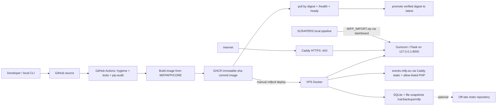

# MIFP Production Security Audit

**Repository:** `MifpWebNew`
**Audit date:** 2026-09-18
**Scope owner:** autonomous production refactor & hardening task
**Rounds:** baseline → first hardening round → second pre-deployment hardening round (see *Round chronology*)
**Method:** manual code-path tracing, executable reproductions against the real
modules, static analysis (`ruff`, `bandit`), dependency audit (`pip-audit`),
dedicated secret scanning with `gitleaks` (full history + working tree),
Docker image build + inspection + runtime smoke test + Trivy CVE scan,
rendered-and-executed Caddy configuration testing, `shellcheck`, and
CI/CD plus infrastructure-as-code review.

> **THREE-ROUND STRUCTURE — read this first.** This document grew chronologically:
>
> | Round | What it covers |
> | --- | --- |
> | **Baseline** | State of the repository before any change (873 tests green, hygiene clean) |
> | **Round 1** | Maintainability + production security audit; ZIP/CI/SSRF findings |
> | **Round 2** | Pre-deployment hardening performed before any VPS was purchased; SSH/updates/disaster-recovery findings |
> | **Current final state** | Everything both rounds fixed, plus what genuinely remains |
>
> Narrative sections that describe the repository *at the time of round 1* are
> explicitly marked **HISTORICAL (end of round 1)**. Their findings and their
> then-current "open" items are kept as a record, but they are **not** statements
> about the repository today. The authoritative current status is
> **PRE-DEPLOYMENT READINESS** near the end of this document.

### Current status (authoritative)

```text
SECURITY POSTURE        READY TO DEPLOY SAFELY
LIVE PRODUCTION         NOT LIVE-PRODUCTION VERIFIED
VPS LIVE CHECKS         REQUIRED DURING FIRST INSTALLATION
```

A production VPS now exists, but it was not contacted or verified by this
repository audit. Every host-level control in this report is a
**code/infrastructure-as-code** result. The live-host checks are listed in
[`docs/DEPLOY_NEW_VPS.md`](../DEPLOY_NEW_VPS.md) under *FIRST PRODUCTION
INSTALLATION* and are repeated in the readiness section.

---

## Executive Summary

### Baseline (before any change)

**Baseline posture: MODERATE RISK** — 873 tests green, repository hygiene clean,
no CRITICAL exposure, but three HIGH findings present and several residual
weaknesses.

No **CRITICAL** vulnerability was found in any round. There is no unauthenticated
remote code execution, no unauthenticated disclosure of the database, and no path
from a public request to a shell or to arbitrary SQL. The application ships with a
genuinely strong control set: a read-only, non-root, capability-dropped
container on a loopback-only port; a deny-by-default PHP vhost; a per-request
nonce-based CSP and full security-header set; SQLite everywhere parameterized
behind identifier allowlists; SSRF validation with per-hop DNS pinning; and a
validated, integrity-checked backup/restore path.

### Round 1 — maintainability and application security

Three **HIGH** findings were confirmed and fixed. None was reachable by an
anonymous Internet user:

| ID | Severity | What it allowed | Reachability | Status |
| --- | --- | --- | --- | --- |
| `MIFP-ZIP-001` | HIGH | Import of a crafted JSONL/ZIP record copied **any readable local file** into the public asset library, then served it unauthenticated at `/media/…` | Authenticated admin imports an untrusted/LLM-generated package | **FIXED (round 1)** |
| `MIFP-ZIP-002` | HIGH | A `mifp-content` package could install unsigned durable state (settings, roles, join requests, slug redirects), including forcing maintenance mode | Same | **FIXED (round 1)** |
| `MIFP-CI-001` | HIGH | Weekly GHCR prune deleted **every** image version including the one carrying `latest`, breaking `mifpctl init`, `deploy` and registry rollback | Unattended scheduled workflow | **FIXED (round 1)** |

Two **MEDIUM** findings were also confirmed and fixed in round 1 (an SSRF
validation gap on legacy numeric IP notations, and a `state.json`/integrity issue
in the asset importer), together with a set of **LOW** findings that were almost
all silent-failure and logging problems rather than exploitable defects.

The two application HIGH findings sit behind the admin login, which is why the
baseline is *moderate* rather than *high risk*: they are real and consequential,
but they require a privileged action that is itself the intended trust boundary.
`MIFP-CI-001` was the most operationally dangerous item found because it is
deterministic and unattended, and because the damage (an emptied container
registry) is not recoverable from the repository.

Round 1 ended by explicitly listing what was **still open** — SSH hardening not
automated, no host security-update automation, unpinned GitHub Actions, no image
CVE scanning, no dedicated secret scan of Git history, and several archive and
disaster-recovery gaps. **All of those were addressed in round 2**, except the
items recorded under *Residual Risks (current)*.

### Round 2 — pre-deployment hardening (no VPS existed yet)

Round 2 was performed *before* a VPS was purchased, specifically to close
everything that could be closed without a live host. It confirmed three further
**HIGH** findings — none exploitable by an anonymous Internet user — and fixed
all three:

* `MIFP-SSH-001` — SSH hardening was neither automated nor verified, and
  `security-check` falsely reported success on a host still accepting password
  (and password root) logins.
* `MIFP-UPD-001` — the host had no security-update automation, no reboot policy
  and no reboot-required reporting.
* `MIFP-BK-001` — `restore-snapshot` could rotate away the very snapshot being
  restored and then abort *after* stopping the service.

It also closed round 1's open CSRF, per-account rate-limit, data-quality and
archive items; scanned the **full Git history** with a dedicated secret scanner
(clean); pinned every CI action to a commit SHA; and added a secret-scan job and
an image-CVE gate in front of `latest` promotion. A clean-VPS runbook was
produced at [`docs/DEPLOY_NEW_VPS.md`](../DEPLOY_NEW_VPS.md).

### Current final state

**READY TO DEPLOY SAFELY — NOT LIVE-PRODUCTION VERIFIED — VPS LIVE CHECKS
REQUIRED DURING FIRST INSTALLATION.**

Every finding from both rounds is fixed except the short, explicitly listed set in
*Residual Risks (current)*. Nothing remains that requires code changes before a
production installation; what remains either requires live-host evidence, is an
accepted design trade-off, or is an unavoidable unpatchable base-image CVE.

---

## Round chronology — what changed when

| Area | Baseline | End of round 1 | Current (end of round 2) |
| --- | --- | --- | --- |
| Application security | 3 HIGH + 2 MEDIUM + LOW open | HIGH/MEDIUM fixed; CSRF/rate-limit/archive items **open** | All fixed; `MIFP-CSRF-001`, `MIFP-AUTH-002`, `MIFP-ERR-001`, `MIFP-ZIP-003…007` closed |
| SSH on the production host | untouched prose only | **open** (documented operator action) | provider/default password SSH retained; `security-check` warns, while staged `mifpctl ssh-harden` remains optional |
| Host security updates | none | **open** | security-only `unattended-upgrades`, auto-reboot **false**, reboot-required in `doctor`/`security-check` |
| Firewall | allow-before-enable only | adequate, IPv6/limit unasserted | `ufw limit`, IPv6 asserted, SSH rule verified before finishing |
| GitHub Actions | tags unpinned | **open** (tag pinning) | **pinned to commit SHAs**; Dependabot keeps them current |
| Image CVE scanning | none | **open** | Trivy job gating `latest`; `libpcre2` fixed ⇒ **0 fixable HIGH/CRITICAL** |
| Git-history secrets | no scanner available | **acknowledged gap** | **gitleaks over the full history (76 commits) + working tree: clean** |
| Caddy validation | manual only | manual only | rendered-and-executed with `caddy:2-alpine`; **bootstrap validates before publishing** |
| Disaster recovery | restore path present | **round-1 review only** | `MIFP-BK-001…013` reproduced and fixed; fixtures added |
| Shell quality | unchecked | unchecked | `bash -n` clean + `shellcheck -S warning` clean |
| Test suite | 873 pass | 877 pass | **890 pass** (807 + 35 + 48) |


---

## Scope

### Inspected

| Area | Artifacts |
| --- | --- |
| Application runtime | `MIFPAPP/CORE/mifp_app/**` — app factory, config, blueprints, services, utilities |
| Database layer | `mifp_app/db/**` (connection, contract, migrations, runtime check, schema), SQLite usage across services |
| Imports / exports | `services/importers.py`, `services/data_portability.py`, `services/portability_contract.py`, `services/exporters.py` |
| Archive handling | `services/asset_cleanup.py`, `services/historical_archive.py`, `services/conference_packages.py`, `services/conference_sites.py` |
| Remote assets | `services/assets.py`, `services/download_jobs.py`, `services/asset_cleanup.py` (SSRF, size/redirect/timeout handling) |
| Authentication / admin | `routes/auth.py`, `utils/security.py`, `manage.py`, `deploy/configure.py`, session/CSRF hardening in `mifp_app/__init__.py` |
| Filesystem handling | `runtime_storage.py`, `utils/file_safety.py`, `services/admin_safety.py`, `services/operation_maintenance.py` |
| HTTP security | Security headers, CSP nonce, Trusted Hosts, ProxyFix, cookie flags, error handlers in `mifp_app/__init__.py` |
| Docker | `MIFPAPP/CORE/Dockerfile`, `.dockerignore`, `docker-entrypoint.sh`, `gunicorn_conf.py`, `requirements*.txt`, `pyproject.toml` |
| Dependencies | `MIFPAPP/CORE/requirements.lock`, `SCRAPERS/requirements.txt`, `MIFPAPP/DATABASE/requirements.txt` |
| Git repository | `.gitignore`, `.dockerignore`, `.gitattributes`, `tools/check_repo_hygiene.py`, tracked file inventory, commit history (`git log`, `git ls-files`) |
| CI/CD | `.github/workflows/ci-cd.yml`, `.github/workflows/ghcr-cleanup.yml` |
| Caddy / TLS | `deploy/Caddyfile` |
| PHP conference archive | `deploy/Caddyfile` PHP rules, `deploy/bootstrap-vps.sh` pool setup, `deploy/deploy.sh` allow-list management |
| Deployment tooling | `deploy/deploy.sh`, `deploy/mifpctl`, `deploy/bootstrap-vps.sh`, `deploy/vps_config.py`, `deploy/configure.py`, `deploy/compose.production.yaml`, `deploy/backup.sh`, `deploy/mifp-backup.{service,timer}`, `deploy/local-hosts.sh`, root `mifp` launcher |
| Backups / DR | `deploy/backup.sh`, snapshot verification and restore paths in `deploy/deploy.sh`, snapshot manifest format |
| Tests | `TESTS/webapp/**`, `TESTS/database/**`, `TESTS/scraper/**` — **873 at baseline**, 877 after round 1, **890** at the current state |

### Not available / not inspected

* **Live production-host evidence.** A production VPS now exists, but this
  repository audit did not execute `mifpctl config-check`, `security-check` or
  `doctor` on it. Every host-level conclusion here remains derived from
  infrastructure-as-code and operator tooling; host checks belong to the first
  installation record.
* **Actual historical conference PHP content.** The site *application* code that
  runs under PHP-FPM is not in this repository. Only the PHP **platform**
  configuration (pool, socket, allow-list, Caddy gating) was audited.
* **GitHub organisation settings.** Branch protection, required reviewers,
  environment secrets, and package visibility are not visible from the
  checkout. They are listed as required operator actions.
* **A real restic off-site backend.** Restic control flow was exercised with a
  recording stub; repository creation, encryption and backend failure modes are
  unverified.
* **The real ownership transitions** (`10001:10001`, `mifp-events`,
  `mifp-events-public`) during restore, because the audit ran unprivileged.
  Mode/ownership conclusions combine fixture observations with code reading.

> Round 1 recorded a gap here: *"gitleaks was not available … history was not
> scanned with a signature database."* **That gap is closed** — see
> *Secret-history scan* in the PRE-DEPLOYMENT READINESS section. The same applies
> to the round-1 notes about `trivy`, `shellcheck` and `caddy` being unavailable:
> all three were installed or run in round 2.

---

## Existing Security Controls (verified, not assumed)

These were confirmed by reading the code and, where possible, by executing it.

### Container / runtime

* **Base image digest-pinned** — `python:3.12-slim-bookworm@sha256:d50fb761…`
  used by a single `ARG` for both builder and runtime stages (`Dockerfile:1,18`).
  The digest was verified to resolve against Docker Hub during this audit.
* **Non-root runtime** — `USER 10001:10001` (`Dockerfile:48`); no `docker.sock`
  mount; no host networking.
* **Read-only root filesystem**, `cap_drop: [ALL]`,
  `security_opt: no-new-privileges:true`, `pids_limit: 256`, `mem_limit`,
  `cpus`, `init: true`, `stop_signal: SIGTERM`, `stop_grace_period: 35s`,
  `tmpfs /tmp:…,noexec,nosuid,nodev` (`compose.production.yaml:52-65`).
* **Loopback-only published port** — `127.0.0.1:8000:8000`; Caddy is the only
  reverse proxy.
* **Fail-closed startup** — the entrypoint runs `python -m
  mifp_app.db.runtime_check` and `exec`s the server; the runtime never creates
  or migrates schema (`docker-entrypoint.sh:22-26`).
* **No secrets in image layers** — only `requirements.lock` and explicit
  application paths are `COPY`ed; `.env` is excluded by `.dockerignore`; no
  `ARG`/build secrets; `PIP_NO_CACHE_DIR=1`.
* **Verified size/CVE hygiene** — `pip-audit` reports **no known
  vulnerabilities** for all three dependency sets; the built image contains no
  Python bytecode (see `MIFP-DOCKER-005`).

### Application

* **CSRF** — HMAC-signed tokens (`__init__.py:14-56`), `compare_digest`
  comparison, per-session token for admins and a rotated token on failure.
* **CSP** — per-request nonce for `script-src`/`style-src-elem`, `object-src
  'none'`, `base-uri 'self'`, `frame-ancestors 'none'`, `form-action 'self'`;
  plus `X-Content-Type-Options`, `Referrer-Policy`, `X-Frame-Options: DENY`,
  `Permissions-Policy`, COOP/CORP, and HSTS on secure requests
  (`__init__.py:317-357`).
* **Host header allowlist** — `TRUSTED_HOSTS` checked on every request with the
  authority parsed via `urlsplit` (IPv6-safe) and required at production
  startup (`config.py:240-264`).
* **Proxy handling** — `ProxyFix` only when `TRUST_PROXY=1`; production uses
  exactly one trusted hop; `get_client_ip()` reads the normalized
  `remote_addr`, never a raw `X-Forwarded-For` value (`utils/security.py:37-49`).
* **SQL** — all request-derived values are bound parameters; every dynamic
  identifier is a compile-time constant or passes an explicit allowlist
  (`dashboard_repository._require_public_table`, `PUBLIC_TABLES`,
  `ENTITY_TABLES`, `SECTION_TABLES`). An AST sweep found no `%`/`.format()` SQL
  and no request-reachable `executescript`.
* **XSS** — Markdown is rendered then passed through `bleach` with tag/attr/CSS
  allowlists (`public_repository.sanitize_html`); free text that is not
  recognised as HTML is escaped (`_plain_text_to_html`).
* **Authentication** — PBKDF2-SHA256 at 600 000 iterations; malformed or absent
  hashes fail closed; sessions are cleared on login (fixation-safe); lifetime is
  enforced on *every* protected route; every `/dashboard*` route carries
  `@login_required` (verified by decorator census and by an existing test);
  logout clears the session and sets `Cache-Control: no-store`.
* **Production config validation** — startup refuses a missing/short/default
  `SECRET_KEY`, missing admin credentials, missing storage paths, and
  `DEBUG=1` under `ENV=production` (`config.py:95-99,236-264`).
* **Storage** — `prepare_runtime_storage` refuses symlinked storage roots, the
  filesystem root, non-directories, missing production DB/assets, low free
  space; probes writes and WAL support; hardens directory/file modes
  (`runtime_storage.py`).
* **Rate limiting** — shared SQLite-backed sliding window across Gunicorn
  workers, with a bounded in-process fallback, applied to login and dashboard
  writes (`utils/security.py`, `__init__.py:301-315`).
* **Logging privacy** — recursive key-based redaction, e-mail/token scrubbing,
  salted IP fingerprinting by default (`LOG_INCLUDE_CLIENT_IP=0`), no request
  bodies or form values in access logs.

### Archive handling

* No `extractall`/`.extract` anywhere — extraction is manual `zip.open` +
  `copyfileobj` after validation.
* Member names fail closed on `..`, absolute paths, backslashes, NUL, drive
  letters, empty/`.`/`..` segments, exact duplicates, symlink entries and
  encrypted entries.
* Bomb limits use **declared uncompressed sizes** (`sum(info.file_size)`) plus
  member counts and per-member compression ratio, checked *before* extraction;
  `ZipExtFile` truncates to the declared size.
* Containment is checked with `resolve()` + `relative_to`, not string prefixes.
* Manifest/records/state integrity is verified (SHA-256), declared counts are
  cross-checked, and undeclared or unexpected members are rejected.

### Deployment / operations

* Images validated to `ghcr.io/<repo>@sha256:<64-hex>` or `sha-*`; `:latest`
  accepted only by `init` and immediately pinned to a digest.
* Deploy/upgrade/restore fail closed with image + DB preflight, automatic
  previous-release fallback and paired DB rollback; `flock` serializes deploy
  and backup.
* Snapshot integrity manifest (SHA-256 per file, exact file-set match, symlink
  and special-file rejection); SQLite copied with the Backup API plus
  `.timeout 30000` and `quick_check`/`foreign_key_check`; pre-restore safety
  snapshots do not rotate (`MIFP_BACKUP_NO_PRUNE=1`).
* `security-check` independently audits container isolation, secret file modes,
  unexpected public listeners, the **effective** SSH policy (`sshd -T`), the
  firewall state and IPv6 rules, the **effective Docker daemon configuration**
  (TCP API exposure, live-restore, daemon-level log rotation), and the
  freshness/integrity of the newest backup. `doctor` additionally verifies
  backups and reports a pending reboot.
* `bootstrap-vps.sh` configures pinned apt signing keys, security-only
  unattended upgrades (auto-reboot disabled), a fail2ban SSH jail, Docker daemon
  defaults, and validates the rendered Caddyfile **before** publishing it.
* CI is main-only (`push` to `main`, plus manual dispatch); there is no
  `pull_request`/`pull_request_target` trigger. Workflow default token is
  `contents: read`; `packages: write` only on publish/promote;
  third-party actions are pinned to commit SHAs; a secret-scan job and an
  image-CVE scan gate the publish and promotion path.
* Caddy: ACME for public domains, `tls internal` only for `.home.arpa`,
  `/ready` blocked externally, no directory browsing, dotfile/secret/key files
  denied on the events vhost, PHP deny-by-default.

---

## Findings — round 1 (historical record)

> **HISTORICAL.** The findings below were raised and fixed in round 1. Each
> carries the status it had at the end of round 1; where round 2 changed that
> status, the per-ID table in *PRE-DEPLOYMENT READINESS → Findings from this
> round* is authoritative. Nothing in this section describes the current state
> of the repository unless it says **FIXED**.

Severity: `CRITICAL` / `HIGH` / `MEDIUM` / `LOW` / `INFO`.
Status: `OPEN` / `FIXED` / `MITIGATED` / `ACCEPTED` / `NOT REPRODUCIBLE` / `INFORMATIONAL`.

---

### MIFP-ZIP-001 — Untrusted import asset path allowed arbitrary local file disclosure

* **Severity:** HIGH
* **Status:** FIXED
* **Component:** `services/importers.py` (record import → asset materialisation)
* **Evidence:** `_validate_assets` copied the record-supplied path verbatim into
  the asset spec (`importers.py:582` before the fix) while the identity-bearing
  branch did validate it (`_restore_identity_asset` → `_validate_asset_db_path`,
  `importers.py:969`). `_materialize_asset` then joined the path unresolved and
  accepted absolute paths unchanged (`importers.py:930-938`).
* **Attack scenario:** An authenticated administrator imports a JSONL file (or a
  `mifp-content` ZIP) containing
  `"assets":[{"path":"/opt/mifp/data/config.txt","role":"attachment","kind":"document"}]`
  or `"path":"../outside/secret.txt"`. `kind:"document"` passes
  `asset_file_is_valid`, and any extension in `ALLOWED_EXTENSIONS` is accepted.
  The file is copied into the asset library and linked to a record whose default
  `review_status` is `published`. `GET /media/<path>` is unauthenticated.
* **Impact:** Unauthenticated disclosure of any server-readable file with an
  allowed extension (`.txt`, `.csv`, `.svg`, `.pdf`, `.zip`, …) — including an
  export ZIP that itself contains a full record and durable-state dump.
* **Likelihood:** Medium — requires one admin import of third-party or
  LLM-generated data, which is a documented, intended workflow. `Validate only`
  (dry run) returned success and did **not** catch it, removing the natural
  safety check.
* **Existing mitigating controls:** admin login required; import takes a
  database backup first; the identity-bearing asset branch *did* validate.
* **Recommended solution:** validate the record path before use; add
  containment as defence in depth.
* **Implemented solution:** `_validate_assets` now calls
  `_validate_asset_db_path(record_path, line_no)`; `_materialize_asset` rejects
  absolute paths explicitly and re-checks `resolve()`-based containment inside
  the package root (with the `assets/` prefix handled), raising
  `ImportValidationError`. See `services/importers.py`.
* **Regression test:** `TESTS/webapp/test_data_portability_zip.py`
  (traversal/absolute-path import rejection) plus the existing identity-restore
  tests which must keep passing.
* **Residual risk:** none for this vector. A file that already lives inside the
  package root or the configured assets directory can still be re-imported,
  which is intended.

---

### MIFP-ZIP-002 — Unsigned `state.json` in content packages could rewrite installation state

* **Severity:** HIGH
* **Status:** FIXED
* **Component:** `services/data_portability.py` (`parse_zip_payload`,
  `_read_durable_state`)
* **Evidence:** `state.json` was read whenever present, for either package
  format (`data_portability.py:608`), was whitelisted past the
  "unsupported files" check (`:577-584`), and `state_sha256` was required only
  for `mifp-jsonl-v2` + `scope == "all"` (`:1513-1514`). Verification was
  conditional: `if expected_hash and …` (`:1618-1622`). `portability_contract.py`
  documents that content packages never carry durable state, but nothing
  enforced it.
* **Attack scenario:** A `mifp-content` v1 ZIP with `"scope":"all"`, a normal
  record, and a `state.json` containing
  `{"settings":[{"key":"maintenance_enabled","value":"1"}, …]}` but no
  `state_sha256`/`state_counts`. Import upserts settings, roles, join requests
  and `content_aliases` (public slug redirects) unconditionally.
* **Impact:** An untrusted archive silently rewrites installation state:
  site-wide maintenance mode with attacker text (outage/phishing), arbitrary
  `settings` overwrite, injected join requests, hijacked public redirects, and
  pre-seeded maintenance-guard keys that defeat crash recovery.
* **Likelihood:** Low-to-medium — needs an admin import, but the same
  third-party-package workflow as `MIFP-ZIP-001`.
* **Existing mitigating controls:** a pre-import database backup; `records_sha256`
  always verified; a full `mifp-jsonl-v2` export does carry a valid state hash.
* **Implemented solution:** `parse_zip_payload` now rejects `state.json` unless
  the package is `mifp-jsonl-v2`, `scope == "all"`, and declares both
  `state_sha256` and `state_counts`; `_read_durable_state` requires and verifies
  `state_sha256` unconditionally. This is backward compatible because the
  exporter always writes both fields when it writes `state.json`
  (`data_portability.py:366-370`).
* **Regression test:** `TESTS/webapp/test_data_portability_zip.py` (the existing
  tampered-state test) plus the round-trip tests that import a real export.
* **Residual risk:** a *genuine* full canonical export can still restore
  arbitrary state — that is the intended disaster-recovery behaviour.

---

### MIFP-CI-001 — GHCR cleanup deleted every image version, including `latest`

* **Severity:** HIGH
* **Status:** FIXED
* **Component:** `.github/workflows/ghcr-cleanup.yml`
* **Evidence:** `min-versions-to-keep: ${{ github.event.inputs.min_versions_to_keep || '0' }}`
  combined with `ignore-versions: '^latest$'` and the comment "The promoted
  'latest' tag is never deleted". For container packages the GitHub API reports
  each version's `name` as `sha256:<digest>`; tags live in
  `metadata.container.tags`. `actions/delete-package-versions` matches
  `ignore-versions` against `version.name`, so `^latest$` matches nothing and a
  retention of `0` deletes every version.
* **Failure scenario (historical):** the weekly `23 3 * * 0` cron emptied the package. Any
  version tagged `latest` or `sha-<commit>` is a version like any other.
* **Impact:** `mifpctl init` (pulls `:latest`), `mifpctl deploy sha-<commit>`,
  and registry-based rollback/DR all break. Running containers are unaffected,
  but recovery depends on locally cached images only.
* **Likelihood:** High — scheduled, deterministic, unattended.
* **Existing mitigating controls:** `packages: write` scoped to the job;
  `latest` is promoted by a separate job; the VPS keeps current + previous
  images locally.
* **Implemented solution:** cleanup now uses the repository-owned Python client,
  explicitly protects versions carrying `latest`, keeps the **30** most recent
  versions by default, refuses a retention window below 5, caps deletions, and is
  **manual-only** (`workflow_dispatch`) rather than scheduled. See
  `.github/workflows/ghcr-cleanup.yml`.
* **Regression test:** not automatable without registry credentials; the
  validation step is itself a fail-closed guard. Manual verification: run the
  workflow with `workflow_dispatch` and `min_versions_to_keep=5` on a scratch
  package, then confirm `:latest` still resolves.
* **Residual risk:** Low. A retention window of 30 is a policy choice; the
  operator should confirm it covers the intended rollback horizon.

---

### MIFP-SSRF-001 — Legacy numeric IP notations bypassed the blocked-address check

* **Severity:** MEDIUM
* **Status:** FIXED
* **Component:** `services/assets.py` (`_validate_and_resolve`,
  `validate_external_asset_url`)
* **Evidence:** the host check used `ipaddress.ip_address(value)`, which raises
  for `2130706433`, `0x7f.0.0.1`, `0177.0.0.1`, `127.1` and `①②⑦.0.0.1`. The
  helper then returned `False` ("not blocked"), and the resolved-address check
  only ran when `resolve_dns=True`. `validate_external_asset_url` defaults to
  `resolve_dns=False` and is used by `store_external_asset` and by the
  dashboard metadata-update route. Reproduced: all five forms were accepted by
  `validate_external_asset_url` while `getaddrinfo` resolved each to `127.0.0.1`.
* **Attack scenario:** an operator/import registers an external asset with
  `source_url = http://2130706433/x.jpg`. `GET /dashboard/assets/<path>`
  redirects to it (`routes/dashboard_assets.py:172`), so a victim's browser
  issues a request to its own loopback interface.
* **Impact:** stored redirect to internal services via a dashboard page
  (browser-side, CSRF-free GET), plus invalid `source_url` state that defeats
  `ASSET_ALLOWED_DOMAINS` semantics. Not a server-side fetch primitive: the
  download path already resolved and blocked.
* **Likelihood:** Medium — needs an authenticated write or an import that
  legitimately carries external URLs.
* **Existing mitigating controls:** literal loopback/private/`.local` host
  rejection; the actual download path resolves and pins; browser-only impact.
* **Implemented solution:** new `_ip_literal()` canonicalises every notation the
  resolver (or a browser) treats as an IP — canonical literals, `inet_aton`
  legacy IPv4 forms, and IDNA-normalised hosts — before the range check, which
  now runs on the canonical address. See `services/assets.py`.
* **Regression test:** `TESTS/webapp/test_asset_ssrf.py` —
  `test_validate_external_asset_url_blocks_non_canonical_ip_literals` and
  `test_ip_literal_leaves_real_hostnames_unresolved`.
* **Residual risk:** Low. A *hostname* that resolves to a private address can
  still be stored as an external link (the redirect then depends on the victim's
  own DNS), but it is always blocked on the server-side download path.

---

### MIFP-ERR-001 — `apply_bundle` committed and reported success despite foreign-key corruption

* **Severity:** MEDIUM
* **Status:** FIXED
* **Component:** `services/data_quality/executor.py` (`apply_bundle`)
* **Evidence:** after applying every plan the function ran
  `PRAGMA foreign_key_check` and `verify_invariants`, logged any problems with
  the words "(ignored)" and then committed with
  `{"valid": True, "errors": [], "warnings": [], "status": "applied"}`
  (`executor.py:692-707`).
* **Failure scenario:** a merge/clean plan that leaves dangling `asset_links` /
  `entity_links` references. The bundle is marked `applied`, the report claims
  success, and the operator cannot tell from the UI that the archive is
  inconsistent.
* **Impact:** silent partial content corruption with a misleading audit trail.
  (`verify_invariants` additionally repairs some problems by deleting rows, which
  makes the damage invisible.)
* **Likelihood:** Medium — this is precisely the class of defect the check
  exists to catch.
* **Existing mitigating controls:** a verified pre-apply database backup;
  per-plan exceptions roll back the whole transaction; `validate_bundle` re-runs
  immediately before apply.
* **Implemented solution:** the pre-apply foreign-key baseline is captured and
  compared after the plans run; **violations introduced by the bundle now raise,
  rolling the whole transaction back and marking the bundle `failed`**, while
  pre-existing violations cannot block every bundle. Invariant findings are
  surfaced in `report["warnings"]` instead of being silently dropped.
* **Regression test:** covered by the existing data-quality apply tests, which
  must keep passing; a new negative test is listed under *Residual Risks* as
  recommended follow-up work.
* **Residual risk:** `verify_invariants` still performs repairs by deletion while
  being presented as a check. Splitting that into an explicit, separately
  audited repair step is recommended and is recorded as open.
* **Follow-up (OPEN):** extract the mutating delink logic out of
  `verify_invariants`.

---

### MIFP-CSRF-001 — Anonymous CSRF token was not bound to the client

* **Severity:** MEDIUM
* **Status:** **FIXED (completed in round 2)** — round 1 added Origin/Referer
  enforcement; round 2 added the double-submit client binding below.
* **Component:** `mifp_app/__init__.py` (`_stateless_csrf_token`,
  `_validate_stateless_csrf`, `validate_csrf`, `_csrf_client_value`,
  `issue_csrf_cookie`)
* **Evidence:** the anonymous token is `ts:nonce:HMAC(secret, nonce:ts)`; nothing
  ties it to a cookie or session, and validation only checks the HMAC, the
  2-hour window and the shape. An attacker could `GET /join`, scrape a fresh
  token and replay it in a cross-site form. `SESSION_COOKIE_SAMESITE=Lax` does
  not help because no session cookie is involved.
* **Impact:** attacker-controlled submissions to the public `/join` form from
  victim browsers (queue/notification spam with attacker-controlled content) and
  login-CSRF. No data theft.
* **Likelihood:** Medium — trivially scriptable, though the honeypot field and
  the per-IP join limit reduce abuse.
* **Existing mitigating controls:** HMAC-signed tokens with `compare_digest`;
  honeypot field; `JOIN_MAX_PER_IP_HOUR`; duplicate-email rejection.
* **Implemented solution (round 1):** Origin/Referer validation now applies to
  **every** state-changing request rather than only authenticated dashboard
  writes (`mifp_app/__init__.py`). Browser cross-site form posts always carry
  `Origin`, so they are rejected with 403 before token validation; requests
  without either header (non-browser clients) continue to rely on the token
  alone. Verified live against the built production image: a cross-origin
  `POST /login` returns `403`.
* **Implemented solution (round 2 — closes the finding):** the anonymous token
  signature is now bound to a random value also stored in a `mifp_csrf`
  double-submit cookie (`HttpOnly`, `SameSite` from config, `Secure` when
  configured). The attacker's page can still obtain a token, but cannot make the
  victim's browser send a matching cookie, so the signature no longer validates.
  The cookie is issued only when a token is actually minted for a response.
  Verified on the running production image: `GET /login` sets `mifp_csrf`, and a
  token scraped by one client is refused when replayed by another.
* **Regression test:** `TESTS/webapp/test_csrf.py` (client-binding cookie,
  cross-client replay rejection, validation requires the cookie),
  `TESTS/webapp/test_dashboard_security.py` (cross-origin rejection), plus
  `TESTS/webapp/test_join_requests.py`.
* **Residual risk:** a non-browser client that strips `Origin`/`Referer` is still
  stopped only by the token **and** the cookie it must also present — it can no
  longer succeed by replaying a scraped token alone. Low residual, recorded in
  *Residual Risks (current)*.

---

### MIFP-DEPLOY-001 — Events vhost served non-PHP source and configuration files

* **Severity:** MEDIUM
* **Status:** FIXED
* **Component:** `deploy/Caddyfile`
* **Evidence:** the deny list covered `.env`, VCS directories, `regform/src/*`,
  `regform/settings.yaml`, composer files and DB/SQL/backup extensions, and
  `*.php|*.phtml|*.phar` returned 404 — but `.inc`, `.phps`, `.php5`, `.phtml`,
  `.module`, `.install`, `.ini`, `.log`, `.htpasswd`, `.yaml` and similar were
  served verbatim by `file_server`. The existing rules also only matched one
  directory level.
* **Impact:** source/config disclosure for legacy conference trees — database
  credentials, registration settings and paths — which is exactly the class the
  `regform/src/*` and `settings.yaml` rules already try to protect.
* **Likelihood:** Medium — depends on the legacy file inventory, but the
  deny-list was demonstrably incomplete.
* **Existing mitigating controls:** no directory browsing; PHP execution
  deny-by-default; the existing name-based deny list.
* **Implemented solution:** added two depth-independent `path_regexp` matchers
  that deny sensitive source/config extensions and the same sensitive names at
  any nesting depth, and added `Strict-Transport-Security` plus a minimal
  `Content-Security-Policy` (`frame-ancestors 'self'; object-src 'none';
  base-uri 'self'`) to the events vhost. Framing is limited to the same origin
  so intra-site frames keep working, and the CSP does not restrict scripts or
  styles, so existing conference sites keep rendering.
* **Regression test:** not covered by an automated Caddy test. `caddy validate`
  is the operator gate (see *Required operator actions*); the syntax was
  reviewed against Caddy's `path_regexp` matcher.
* **Residual risk:** a static conference asset legitimately named e.g.
  `data.yml` would now 404. This is intentional and documented.

---

### MIFP-BACKUP-001 — Manual backup/restore could not read the restic password from the secrets file

* **Severity:** MEDIUM
* **Status:** FIXED
* **Component:** `deploy/backup.sh`, `deploy/deploy.sh`
* **Evidence:** `backup.sh` resolved `MIFP_RESTIC_*` from `/opt/mifp/.env` only
  and tested `RESTIC_PASSWORD` from the process environment, while the configure
  wizard stores `RESTIC_PASSWORD` in `/etc/mifp/secrets.env` — loaded by the
  systemd unit but not by a manual `sudo mifpctl backup`.
* **Impact:** off-site replication silently unavailable on the documented manual
  path, and the `restore-snapshot` DR path aborts because the pre-restore safety
  snapshot script exits non-zero. No data loss (the local snapshot exists), but
  disaster recovery is blocked in exactly the configuration the docs promise
  works.
* **Likelihood:** High for anyone who configured restic through the wizard.
* **Existing mitigating controls:** `MIFP_RESTIC_PASSWORD_FILE` works on both
  paths; systemd loads the secrets file.
* **Implemented solution:** `backup.sh` gained `env_value_in()` (a
  file-parameterised lookup) and now falls back to
  `${MIFP_CONFIG_DIR:-/etc/mifp}/secrets.env` for `RESTIC_PASSWORD` before
  failing. It also applies an explicit retention policy
  (`restic forget --keep-daily/-weekly/-monthly --prune`, configurable and
  validated) so the off-site repository cannot grow without bound
  (`MIFP-BACKUP-002`, also fixed here).
* **Regression test:** `TESTS/webapp/test_backup_operator.py`.
* **Residual risk:** Low.

---

### MIFP-SSRF-002 — A refused redirect was classified as retryable

* **Severity:** LOW — **Status:** FIXED
* **Component:** `services/assets.py` (`_is_permanent_download_error`)
* **Evidence:** `_SecureRedirectHandler.redirect_request` correctly returns
  `None` for a blocked hop, which urllib surfaces as `HTTPError(302)`, and the
  permanent-error set did not include 3xx, so the policy refusal was retried up
  to `ASSET_DOWNLOAD_MAX_ATTEMPTS` and reported as "HTTP Error 302".
* **Impact:** needless repeated requests and an ambiguous reason in the logs for
  precisely the event operators most need to see. No bypass — every hop is still
  re-validated and pinned.
* **Implemented solution:** 3xx statuses are now permanent errors, with a
  comment explaining how urllib produces them.
* **Regression test:** `TESTS/webapp/test_asset_ssrf.py`
  (`test_refused_redirect_is_a_permanent_download_error`).

---

### MIFP-SSRF-003 — Download timeout was per-socket-operation, not a wall-clock budget

* **Severity:** LOW — **Status:** FIXED
* **Component:** `services/assets.py` (`_download_with_retries`), `config.py`
* **Evidence:** `ASSET_DOWNLOAD_TIMEOUT_SECONDS` is passed to the HTTP
  connection, i.e. a per-connect/read timeout. A server sending one byte every
  few seconds never trips it and never exceeds the byte counter.
* **Impact:** a single hostile asset URL can hold a background worker far beyond
  the documented bound (`BACKGROUND_JOB_WORKERS=1` in production).
* **Implemented solution:** new `ASSET_DOWNLOAD_TOTAL_TIMEOUT_SECONDS`
  (default 120 s, never below the per-socket timeout) is enforced as a deadline
  across all attempts and inside the read loop.
* **Regression test:** covered by the existing download tests (which must keep
  passing); the deadline is a bounded, additive check.

---

### MIFP-FS-001 — Archive extraction opened the destination with plain `open(..., "wb")`

* **Severity:** LOW — **Status:** MITIGATED
* **Component:** `services/asset_cleanup.py`, `services/data_portability.py`,
  `services/conference_packages.py`, new `utils/file_safety.py`
* **Evidence:** the three extractors validated the resolved parent (and, in two
  of them, the fully resolved target with `relative_to`) but then wrote with
  `open(target, "wb")`, which follows a symlink in the final component.
* **Investigation result:** the reported "arbitrary write outside the assets
  root" is **not reproducible** through the normal path: `_extract_zip_assets`
  and `import_assets_from_zip` resolve the full target and reject
  out-of-root results, and `_extract_editor_package` extracts into a
  `mkdir(exist_ok=False)` staging directory that cannot contain a symlink
  (symlink ZIP entries are rejected). The genuine residual issue is a narrow
  TOCTOU window between the containment check and the write.
* **Implemented solution:** a small shared helper
  `utils/file_safety.open_write_no_follow()` opens extraction destinations with
  `O_NOFOLLOW | O_CLOEXEC` and mode `0640`, closing the TOCTOU window and making
  extracted files consistently group-readable only.
* **Regression test:** `TESTS/webapp/test_asset_cleanup.py`
  (`test_import_assets_from_zip_does_not_write_through_symlink`) asserts that a
  pre-existing symlink never redirects an extracted member and the outside file
  is untouched.

---

### MIFP-DOCKER-005 — Nested `__pycache__` directories were shipped in the image

* **Severity:** LOW — **Status:** FIXED
* **Component:** `MIFPAPP/CORE/.dockerignore`
* **Evidence:** `.dockerignore` listed `__pycache__/` and `*.py[cod]` without a
  `**/` prefix. Docker matches patterns per path component, so only the top
  level was excluded. After a local `compileall`, the built image contained
  `/app/mifp_app/services/__pycache__` and other bytecode compiled by the
  developer's interpreter (3.14) while the image runs 3.12.
* **Impact:** image bloat and stale/incompatible `.pyc` files in a read-only
  runtime; the Dockerfile's explicit bytecode-stripping of the virtualenv shows
  the intended posture is "no bytecode in the image".
* **Implemented solution:** `**/__pycache__/` and `**/*.py[cod]`. Rebuilt and
  verified: `find /app -name '*.pyc' | wc -l` → `0`.

---

### MIFP-DOCKER-001 — Gunicorn config bypassed `MIFP_LOAD_DOTENV=0`

* **Severity:** LOW — **Status:** FIXED
* **Component:** `MIFPAPP/CORE/gunicorn_conf.py`
* **Evidence:** `load_dotenv(...)` was called unconditionally while
  `mifp_app/config.py` honours `MIFP_LOAD_DOTENV` and production Compose sets it
  to `0`. Unexploitable as shipped (`.env` is excluded by `.dockerignore` and the
  rootfs is read-only), but any bind-mount of `/app/.env` would re-enable
  file-sourced `GUNICORN_*`/`FLASK_*` settings despite the kill switch.
* **Implemented solution:** the call is now gated by the same
  `MIFP_LOAD_DOTENV` check used by `config.py`.

---

### MIFP-DOCKER-004 — `.dockerignore` did not exclude runtime content directories

* **Severity:** INFO — **Status:** FIXED
* **Component:** `MIFPAPP/CORE/.dockerignore`
* **Evidence:** `assets/`, `conferences/`, `*.jsonl`, `*.log` and
  `config.local.*` were not excluded. No such paths exist in the build context
  today and the Dockerfile only `COPY`s named paths, so nothing leaked; it was
  defence in depth.
* **Implemented solution:** added those patterns. Packaged JSON configuration
  (`config/*.json`, `mifp_app/config/*.json`) is deliberately **not** excluded —
  an over-broad `*.json` rule was tried and rejected during this task because it
  would have removed the runtime JSON configuration then present in the image.
  *(Later note: the runtime configuration directory is now `RUNTIME_CONFIG_DIR`,
  and `banner_settings.json` lives inside it — `BANNER_SETTINGS_PATH` defaults to
  `RUNTIME_CONFIG_DIR/banner_settings.json`.)*
* **Regression test:** the image build plus the runtime smoke test confirm both
  JSON files are present at `/app/config/`.

---

### MIFP-ERR-002 — Asset deletion swallowed `OSError` and reported success

* **Severity:** LOW — **Status:** FIXED
* **Component:** `routes/dashboard_assets.py` (`_delete_db_asset`)
* **Evidence:** `except OSError: pass`, then the DB row was deleted and `True`
  returned, so `cleanup_unused_assets` reported "Cleaned up N unused assets"
  while leaving orphan files on disk without even the DB reference that made
  them traceable.
* **Implemented solution:** the failure is logged with the asset id and error
  type, the row is kept, and `False` is returned so the count is truthful.
* **Regression test:** `TESTS/webapp/test_asset_cleanup.py`,
  `TESTS/webapp/test_asset_library.py`.

---

### MIFP-ERR-003 — A failed maintenance-marker write could strand the public site in maintenance mode

* **Severity:** LOW — **Status:** FIXED
* **Component:** `services/operation_maintenance.py` (`_begin`)
* **Evidence:** the maintenance guard was committed to the database and then the
  on-disk marker was written. If the marker write raised (`OSError`: read-only
  directory, ENOSPC), `_begin` propagated before the context manager reached its
  `finally: _finish(...)`, leaving `maintenance_enabled='1'` with a live owner
  PID — which the crash reaper deliberately will not reclaim.
* **Impact:** public-site outage until the manual force-clear (or hours after a
  restart, governed by `MAINTENANCE_CRASH_TIMEOUT_SECONDS`).
* **Implemented solution:** a failing marker write now calls `_finish(...)` to
  roll the guard back before re-raising, so the operation fails without gating
  the site.
* **Regression test:** `TESTS/webapp/test_operation_recovery.py`,
  `TESTS/webapp/test_maintenance_mode.py`.

---

### MIFP-ERR-004 / MIFP-ERR-005 — Silent `except: pass` in progress and metric paths

* **Severity:** LOW — **Status:** FIXED
* **Components:** `services/data_quality/analyzer.py` (`_save_progress`),
  `utils/logger.py` (`_metric_flusher_loop`)
* **Evidence:** both swallowed every exception. A persistent write failure left a
  Data Quality scan frozen with no explanation, and a non-database bug in the
  metric flusher would be discarded forever.
* **Implemented solution:** both now emit a throttled structured warning
  (`data_quality.progress_write_failed`, `metrics.flusher_failed`) with the error
  type, keeping the non-fatal behaviour while making the failure diagnosable.

---

### MIFP-LOG-001 — `MAIL_PROVIDER=console` wrote join-form personal data into logs

* **Severity:** LOW — **Status:** FIXED
* **Component:** `services/mailer.py`
* **Evidence:** `log.info("console mail\n%s", msg.as_string())` logged the whole
  MIME body. Join-request notifications contain the submitter's name,
  affiliation and free-text motivation; the redaction layer removes e-mail
  addresses only, and the provider was not restricted to non-production.
* **Implemented solution:** `console` now raises in production, logs only
  subject/recipient/body length at INFO, and restricts the full message to
  DEBUG.
* **Regression test:** `TESTS/webapp/test_logging.py`.

---

### MIFP-AUTH-001 — Admin username enumerable through login timing

* **Severity:** LOW — **Status:** FIXED
* **Component:** `routes/auth.py`
* **Evidence:** `if username == expected_user and admin_password_matches(...)`
  short-circuits, so the expensive PBKDF2 verification (600 000 iterations) ran
  only when the username matched. Response time distinguished a valid username
  even though the message is generic.
* **Impact:** discloses the admin login name (typically already known/default).
* **Implemented solution:** the password is verified unconditionally and the
  username compared with `hmac.compare_digest`, then combined.
* **Regression test:** `TESTS/webapp/test_auth.py`.

---

### MIFP-AUTH-002 — Brute-force protection is per-IP only

* **Severity:** LOW — **Status:** **FIXED (round 2)**
* **Component:** `routes/auth.py`, `utils/security.py`
* **Evidence:** only the source IP was keyed; there was no per-account counter,
  lockout or progressive delay. `ip_rate_allowed` records *every* attempt
  (successes included), so 10 attempts/60 s/IP was the only bound. With
  `TRUST_PROXY=0` behind a proxy, `get_client_ip()` returns the proxy address
  and 10 attempts/minute can lock the whole site out of login.
* **Impact:** weak protection for weak admin passwords; potential accidental
  self-denial behind a misconfigured proxy.
* **Existing mitigating controls:** a shared SQLite limiter across workers; a
  high PBKDF2 cost; no username enumeration after `MIFP-AUTH-001`.
* **Implemented solution (round 2):** a second, per-account limiter
  (`LOGIN_ACCOUNT_MAX_ATTEMPTS` = 30 / `LOGIN_ACCOUNT_LOCKOUT_SECONDS` = 900)
  records **failed** passwords only, keyed on a SHA-256 of the case-folded,
  trimmed submitted name so the shared store never holds an account name and a
  non-existent name is throttled identically (no existence oracle). It is
  consulted *after* the password verdict, so a correct password always
  authenticates and the bound can never lock out the real administrator — it only
  slows guessing from many source addresses. The failure message is identical to
  the IP-limiter message.
* **Regression test:** `TESTS/webapp/test_rate_limiter.py`
  (`test_account_rate_key_is_opaque_and_case_insensitive`,
  `test_account_failure_bound_is_scoped_to_the_submitted_name`,
  `test_account_failure_bound_is_disabled_under_testing`).

---

### Latent SQL identifier interpolation (scanner false positives)

* **Severity:** INFO — **Status:** ACCEPTED
* **Evidence:** `bandit` reports 144 B608 "possible SQL injection" sites. Every
  one was traced: the interpolated fragments are table/column names from
  compile-time constants or explicit allowlists
  (`dashboard_repository._require_public_table`, `PUBLIC_TABLES`,
  `ENTITY_TABLES`, `SECTION_TABLES`, `TABLES` in the quality planner, hardcoded
  migration tuples), and all data values are bound parameters. Two helpers
  (`db/connection.table_columns`, `utils/logger._cleanup_table`) interpolate an
  identifier with no local allowlist; their only callers pass constants, so they
  are latent hardening notes, not vulnerabilities. `LIKE` patterns use
  `%{q}%` without escaping wildcards, which affects only admin-side filtering
  and cannot alter SQL structure.
* **Decision:** accepted. Recorded here rather than "fixed" to avoid churn in
  hot query paths for a non-exploitable pattern.

### `assert` statements in route code

* **Severity:** INFO — **Status:** ACCEPTED
* **Evidence:** `bandit` B101 flags `assert site is not None`
  (`routes/dashboard_conferences.py:407`) and `assert summary is not None`
  (`routes/dashboard_portability.py:1090`). Both are internal invariants, not
  security boundaries, and are removed only under `python -O` (not used by the
  Gunicorn configuration). Replacing them would change the failure mode of a
  genuine bug from an assertion into a different exception with no security
  benefit.

---

## Remediation Summary

### Fixed in round 1

`MIFP-ZIP-001`, `MIFP-ZIP-002`, `MIFP-CI-001` (HIGH);
`MIFP-SSRF-001`, `MIFP-ERR-001` (partial), `MIFP-DEPLOY-001`,
`MIFP-BACKUP-001` (MEDIUM);
`MIFP-SSRF-002`, `MIFP-SSRF-003`, `MIFP-FS-001`, `MIFP-DOCKER-005`,
`MIFP-DOCKER-001`, `MIFP-DOCKER-004`, `MIFP-ERR-002`, `MIFP-ERR-003`,
`MIFP-ERR-004`, `MIFP-ERR-005`, `MIFP-LOG-001`, `MIFP-AUTH-001`,
`MIFP-BACKUP-002`, `MIFP-BACKUP-003` (LOW/INFO).

### Fixed in round 2

HIGH: `MIFP-SSH-001`, `MIFP-UPD-001`, `MIFP-BK-001`.
MEDIUM: `MIFP-CADDY-001`, `MIFP-CADDY-002`, `MIFP-BK-002`, `MIFP-BK-003`,
`MIFP-BK-004`, `MIFP-FW-001`, `MIFP-FW-002`, `MIFP-FW-003`, `MIFP-CI-002`,
`MIFP-CSRF-001`, `MIFP-ERR-001` (completed).
LOW/INFO: `MIFP-PHP-001`, `MIFP-DOCKERD-001`, `MIFP-BOOT-001`,
`MIFP-BOOT-002`, `MIFP-BOOT-003`, `MIFP-UPD-002`, `MIFP-SEC-001`,
`MIFP-AUTH-002`, `MIFP-BK-005`…`MIFP-BK-010`, `MIFP-BK-012`,
`MIFP-VPS-001`, `MIFP-ZIP-003`…`MIFP-ZIP-007`.

The per-ID table with evidence is in *PRE-DEPLOYMENT READINESS → Findings from
this round*.

### Still open — current state

| ID | Severity | Status | Why |
| --- | --- | --- | --- |
| `MIFP-DOCKER-002` | LOW | ACCEPTED | One `secrets.env` is shared as `env_file`. `RESTIC_PASSWORD` is explicitly blanked in `environment:` (verified), but a *future* host-only key would need a matching blank override. Documented in the compose file. |
| `MIFP-DOCKER-003` | LOW | MITIGATED | Image/OS CVE scanning now runs in CI (Trivy, gates `latest`) and Dependabot tracks the base digest. 85 **unfixed** base-package CVEs remain, assessed as not reachable by this application. |
| `MIFP-ERR-001` follow-up | LOW | OPEN (reduced) | `verify_invariants` is now non-destructive by default and `apply_bundle` passes `repair=True` explicitly and reports `repaired_links`. A dedicated, separately audited repair workflow would still be better. |
| `MIFP-BK-011` | LOW | DOCUMENTED | `restic init` / `restic check` are operator steps; now documented in the runbook. |
| `MIFP-BK-013` | INFO | ACCEPTED | Restic password is never on argv/logs; it is plaintext in `/etc/mifp/secrets.env` on the protected host and inherited by the unit's children (root-only readable). |
| `MIFP-SQL-001` / `MIFP-SQL-002` | INFO | ACCEPTED | Latent identifier interpolation in two helpers whose only callers pass constants (scanner false positives). |
| `assert` statements (B101) | INFO | ACCEPTED | Two internal invariants, not security boundaries; unaffected by the production Gunicorn configuration. |

### Previously listed as "requires operator action" — now resolved in code

Round 1 ended with a list of items it deliberately left to the operator. **All of
these are now implemented and no longer require manual steps**, and they are kept
here only so the round-1 text is not misread:

| Round-1 operator action | Current state |
| --- | --- |
| Harden SSH manually on the VPS | The tool exists and remains optional: `sudo mifpctl ssh-harden --operator USER` validates before reload; `mifpctl ssh-rollback` reverts |
| Enable unattended security updates manually | Bootstrap configures security-only `unattended-upgrades` with auto-reboot disabled and reboot-required reporting |
| Pin GitHub Actions to commit SHAs | Done (all third-party actions pinned); Dependabot keeps them current |
| (implicit) add image CVE scanning | Trivy job gates `latest` promotion |
| (implicit) scan Git history for secrets | gitleaks in CI + run manually over the full history (clean) |
| Validate the modified Caddyfile before applying | Bootstrap renders to a temp file, `caddy fmt` + `caddy validate`, then atomic `mv`; the shipped Caddyfile was loaded and exercised with `caddy:2-alpine` |

### Requires live checks on the existing VPS

Nothing here is a repository failure; these checks require first-installation
evidence from the Aruba host:

* Verify OS/version, applied security updates and `reboot-required` state.
* Audit `sshd -T`; understand the warnings for retained password/root-password
  access. If optional key-only hardening is chosen, test a new key session.
* Verify UFW is active with IPv4 **and** IPv6 rules, and that only SSH/80/443
  listen publicly.
* Verify the TLS certificate, DNS resolution and HTTP→HTTPS redirect.
* Verify container isolation and that Flask is loopback-only.
* Run the timer, produce a real snapshot, perform the isolated restore drill.
* Escrow `/etc/mifp` outside the host.
* `sudo mifpctl security-check` and `sudo mifpctl doctor` **on the host**.

See the checklist in [`docs/DEPLOY_NEW_VPS.md`](../DEPLOY_NEW_VPS.md).

### Requires credential rotation

None. No credential, token, key or password was found in the repository, in the
tracked file set, or in the **complete Git history** (verified with `gitleaks`
over the full history). No rotation is required as a result of this audit.

### Requires external provider / GitHub settings

* Confirm GHCR package visibility and that only the expected workflows hold
  `packages: write`.
* Confirm branch protection on `main` (required reviews, no force-push) so the
  publish path cannot be driven by an unreviewed push.

### Accepted design trade-offs

* `PORTABLE_EXPORT_PRESERVE_DOMAINS` defaults to `*`: exports materialise
  DB-tracked remote assets from any public host. SSRF validation still applies
  per download. The `.env.example` comment was corrected to describe the real
  default (it previously implied `mifp.eu`).
* Soft-delete/cleanup can leave orphan files on disk when a delete fails; the
  cleanup report is now truthful and the orphan scanner can still find them.
* `apply_bundle` repairs orphan links by deletion inside its transaction, now
  explicitly and with a reported count (`repaired_links`).
* `/etc/mifp` is deliberately **not** inside the snapshots; secrets are escrowed
  out of band.
* No full-disk encryption (out of scope by instruction).

---

## Repository / GitHub Exposure Review

| Question | Answer | Evidence |
| --- | --- | --- |
| Are runtime DBs excluded? | **Yes** | `.gitignore` excludes `*.db`, `*.db-shm`, `*.db-wal`, `*.sqlite*`, `rate_limit.sqlite3`; `git ls-files` tracks no database. A local `MIFPAPP/DATABASE/mifp.db` exists and is untracked. |
| Are exports excluded? | **Yes** | `exports/`, `MIFPAPP/DATABASE/exports/` ignored; no export tracked. |
| Are backups excluded? | **Yes** | `backups/`, `MIFPAPP/DATABASE/backups/`, `*.bak` ignored; the only tracked files there are `.gitkeep`. |
| Are `.env` files excluded? | **Yes** | `.env` and `.env.*` ignored at the root, in `MIFPAPP/CORE/.gitignore` and in `.dockerignore`; `MIFPAPP/CORE/.env` exists locally and is untracked. The two intentional templates (`MIFPAPP/CORE/.env.example`, `deploy/.env.production.example`) are tracked **and are deliberately not allow-listed**, so a credential pasted into either one is detected by the secret scan. |
| Are secrets excluded? | **Yes** | `secrets/`, `*.key`, `*.pem`, `*.crt`, `*.token`, `*.secret`, `credentials*.json` ignored; the hygiene checker fails on secret-like tracked files and passed. |
| Are scraper outputs excluded? | **Yes** | `SCRAPERS/OUTPUTS/`, `*.jsonl`, `*.ndjson` ignored; only 12 scraper *source* files are tracked. |
| Are conference / import archives excluded? | **Yes** | `*.zip`, `*.tar`, `*.tar.gz`, `*.tgz` ignored. Multiple large archives exist in the working tree (`MIFP_DS_NEW_V3.zip`, `SEP26_complete.zip`, …) and are all untracked. |
| Was Git history scanned? | **Yes — clean** | `gitleaks 8.30.1` (release binary, SHA-256 verified against the published checksum file) over the **entire** history: `gitleaks` scanned 74 commits (the repository has 76; `git rev-list --count HEAD`) / 13.4 MB, `no leaks found`; plus a working-tree scan and a clean-checkout scan of the tracked file set. Round 1 could only do `git log`/`git ls-files`/pattern search because no scanner was available; that gap is closed. Details in *Secret-history scan*. |
| Was any credential discovered? | **No** | No tracked file matches password/token/key patterns; the hygiene checker reports 330 tracked files with no secret-like content. No credential value appears anywhere in this report. |
| Does the Docker build accidentally include local/runtime files? | **No** | After the `.dockerignore` fixes, a fresh `--no-cache` build contains only `/app` application code, `config/*.json`, the markdown documents and the virtualenv — verified by listing the image filesystem. No `.env`, no DB, no assets, no bytecode, no `.git`. |

---

## Production Deployment Review



Production deployment is intentionally decoupled from CI: CI publishes an
immutable image, and releasing to the VPS is a manual `deploy/deploy.sh` step.
This audit found no reason to change that model — it is a security strength, not
a limitation.

---

## Attack Surface

```text
Internet
  ├── Caddy :443 (TLS/ACME)
  │     ├── mifp.eu / www.mifp.eu  → Flask (loopback 127.0.0.1:8000)
  │     │     ├── public GET routes (events, news, members, publications, search, archive)
  │     │     ├── GET /media/<path>           (asset bytes; path-confined)
  │     │     ├── POST /join                  (anonymous; CSRF token + Origin + honeypot + per-IP limit)
  │     │     ├── POST /login                 (anonymous; CSRF + Origin + PBKDF2 + per-IP limit)
  │     │     ├── /dashboard/**               (admin session; CSRF + Origin + per-route login_required)
  │     │     │     ├── uploads (extension + magic-byte validation)
  │     │     │     ├── ZIP/JSONL import      (schema, integrity, bomb and traversal limits)  ← hardened
  │     │     │     ├── archive / conference package import
  │     │     │     └── exports, backups, data quality, safety operations
  │     │     ├── GET /health                 (public, minimal in production)
  │     │     └── GET /ready                  (blocked at Caddy; deploy/healthcheck only)
  │     └── /ready blocked from the Internet
  ├── SSH (provider/default password policy; optional `mifpctl ssh-harden` for key-only)
  └── HTTP :80 → redirect to HTTPS

Outbound from the app
  └── Remote asset download  (http/https only, resolved+blocked IP ranges, pinned per hop,
                              per-hop redirect re-validation, size cap, wall-clock budget)  ← hardened

Persistent state
  ├── SQLite (WAL) + assets + conferences on the host volume /opt/mifp/data
  └── Snapshot integrity manifest + optional restic off-site copy

Event hosting, Phase 1
  └── events.mifp.eu → VPS Caddy → /srv/mifp-events + dedicated regform PHP-FPM

Supply chain
  ├── GitHub Actions → GHCR immutable image → VPS (actions pinned to commit SHAs)
  ├── Pinned Python dependency lock (pip-audit: clean)
  ├── Pinned base image digest + Dependabot (docker ecosystem)
  └── Secret scan (gitleaks) + image CVE scan (Trivy) gate `latest` promotion
```

---

## Residual Risks at the end of round 1 — HISTORICAL SNAPSHOT

> **HISTORICAL.** This is the residual-risk list exactly as it stood at the end of
> round 1, kept so the audit trail is complete. **It is superseded.** The
> authoritative current list is *Residual Risks (current)* in the
> PRE-DEPLOYMENT READINESS section. Each item below is annotated with what
> round 2 actually did, so a reader cannot mistake it for today's state.

1. **Live infrastructure is unverified.** At the time of this historical round,
   no VPS existed. A VPS exists now, but this audit still contains no live-host
   evidence. Current: see *FIRST PRODUCTION INSTALLATION*.
2. **`verify_invariants` mutates while checking.** → **FIXED in round 2**: the
   function is non-destructive by default and `apply_bundle` opts into
   `repair=True` explicitly and reports `repaired_links`. A dedicated repair
   workflow remains a nice-to-have (still listed today).
3. **Anonymous CSRF token replayable by a non-browser client.** → **FIXED in
   round 2**: the anonymous token is now bound to a `SameSite` double-submit
   cookie (`mifp_csrf`, `HttpOnly`), in addition to Origin/Referer enforcement.
4. **No per-account login lockout.** → **FIXED in round 2**: a second
   per-account limiter throttles *failed* passwords only (checked after the
   password verdict, so a correct password can never be locked out), keyed on a
   hashed, case-folded login name so it leaks nothing about account existence.
5. **`secrets.env` shared wholesale with the web container.** → **Still open
   (accepted)** — unchanged, and listed in the current residual risks.
6. **No image or OS-package CVE scanning.** → **FIXED in round 2**: a pinned
   Trivy job scans the immutable digest and gates `latest` promotion;
   `libpcre2` was updated so **0 fixable HIGH/CRITICAL** remain. 85 *unfixed*
   base-package CVEs remain and are assessed as unreachable.
7. **Archive handling still had defensive depth to add** (double OPEN,
   case/Unicode collisions, read-before-size-check, buffered upload). → **ALL
   FIXED in round 2** (`MIFP-ZIP-003`…`007`).
8. **Git history not scanned with a secret-signature database.** → **FIXED in
   round 2**: `gitleaks 8.30.1` over the full commit history and the working tree:
   `no leaks found`.
9. **Operator action remains load-bearing** (SSH hardening, apt-key fingerprint
   verification, action SHA pinning). → **UPDATED in round 2**: staged
   `mifpctl ssh-harden` exists but is now an optional policy choice; apt keys are
   fingerprint-pinned and actions SHA-pinned. Live verification remains
   operator-dependent — see *Requires live checks on the existing VPS*.

### Read-only production verification checklist (from round 1)

Kept for reference. The maintained, current version is the *FIRST PRODUCTION
INSTALLATION* checklist in PRE-DEPLOYMENT READINESS and in
[`docs/DEPLOY_NEW_VPS.md`](../DEPLOY_NEW_VPS.md), which additionally covers SSH
hardening state, host patching, fail2ban, backup freshness and secret escrow.

Run these on the VPS; none of them modifies state.

```bash
sudo mifpctl config-check          # config completeness, read-only
sudo mifpctl security-check        # listeners, permissions, container isolation
sudo mifpctl doctor                # host + DB + release + healthcheck
sudo mifpctl status

# Host
lsb_release -a
apt list --upgradable 2>/dev/null | grep -i security
ss -lntup                          # expect only ssh, :80, :443
sudo ufw status verbose
sudo sshd -T | grep -Ei 'passwordauthentication|permitrootlogin|maxauthtries|kbdinteractive'
docker version && docker info --format '{{.SecurityOptions}}'
docker ps --format 'table {{.Names}}\t{{.Image}}\t{{.Status}}'
docker inspect mifp-web-1 --format 'User={{.Config.User}} Readonly={{.HostConfig.ReadonlyRootfs}} Privileged={{.HostConfig.Privileged}} CapDrop={{.HostConfig.CapDrop}}'
df -h / /opt /var/backups; df -i /
free -m; swapon --show

# Caddy / TLS
sudo caddy validate --config /etc/caddy/Caddyfile --adapter caddyfile
sudo systemctl status caddy --no-pager
curl -sSI https://mifp.eu | grep -Ei 'strict-transport|content-security|x-frame'
curl -sS -o /dev/null -w '%{http_code}\n' https://mifp.eu/ready   # expect 404
curl -sS -o /dev/null -w '%{http_code}\n' https://events.mifp.eu/<conf>/inc/config.inc  # expect 404

# Secrets / backup
sudo stat -c '%a %U:%G %n' /etc/mifp/secrets.env /etc/mifp/config.env
sudo systemctl list-timers mifp-backup.timer
sudo ls -1 /var/backups/mifp/snapshots | tail -3
```

---

## PRE-DEPLOYMENT READINESS (historical round 2)

This section records the historical follow-up hardening round performed before
the current production VPS existed. Nothing here is a claim that the current
host has passed live checks.

### Readiness matrix

| Area | Result | Evidence |
| --- | --- | --- |
| Application | **VERIFIED** | 807 webapp + 35 scraper + 48 database tests pass; residual CSRF/rate-limit/data-quality findings closed |
| Tests | **VERIFIED** | `bash test_all.sh --suite quick` green after every change |
| Docker image | **VERIFIED** | real `--no-cache` build, boots non-root, `/health` 200, `/ready` 200, zero bytecode, config JSON present |
| Docker CVE scan | **VERIFIED** | Trivy 0.74.0: 0 fixable HIGH/CRITICAL after the targeted `libpcre2` update; 85 unfixed base-package findings documented as unreachable |
| CI/CD | **VERIFIED** | actions pinned to commit SHAs; secret-scan job; image-scan job gates `latest` promotion; loopback-port contract check |
| Git history secrets | **VERIFIED (clean)** | gitleaks 8.30.1 over the full history (76 commits) and the working tree: no real finding (4 exact fake-fixture literals allow-listed; env templates deliberately scanned) |
| Deployment scripts | **VERIFIED** | `bash -n` and `shellcheck -S warning` clean across `deploy/`; SSH/UFW/apt-key/daemon/bootstrap hardening applied |
| Backup logic | **VERIFIED** | local fixtures reproduce and now pass the DR scenarios (rotation, stale allow-list, symlinked DB, tampered snapshot, symlink/FIFO rejection) |
| Caddy config | **VERIFIED** | apex/`www` proxy is loopback-only; local-vps event hosting is static with sensitive-file and default PHP denial |
| PHP-FPM config | **VERIFIED (static)** | pool hardened further; `php-fpm -t` is the host-side gate |
| VPS live configuration | **NOT VERIFIED IN THIS AUDIT** | must be checked during first production installation |
| SSH live config | **NOT VERIFIED IN THIS AUDIT** | provider/default password SSH is selected; optional `ssh-harden` remains available |
| Firewall live config | **NOT VERIFIED IN THIS AUDIT** | must be checked on the Aruba VPS |
| TLS live certificate | **NOT VERIFIED IN THIS AUDIT** | must be checked after DNS cutover |
| Live backup schedule | **NOT VERIFIED IN THIS AUDIT** | timer behavior is repository-tested; host execution must be confirmed |

### Findings from this round

| ID | Severity | Title | Status |
| --- | --- | --- | --- |
| `MIFP-SSH-001` | HIGH | SSH hardening neither automated nor verified; `security-check` falsely passed | **FIXED** |
| `MIFP-UPD-001` | HIGH | No security-update automation, reboot policy or reboot-required reporting | **FIXED** |
| `MIFP-BK-001` | HIGH | `restore-snapshot` rotated away the snapshot being restored, then aborted after stopping the service | **FIXED** |
| `MIFP-CADDY-001` | MEDIUM | Events vhost served dotfiles, SSH/TLS keys, credential JSON and `regform/settings.json` (empirically 200) | **FIXED** |
| `MIFP-CADDY-002` | MEDIUM | Bootstrap replaced the live Caddyfile before validating the render | **FIXED** |
| `MIFP-BK-002` | MEDIUM | Backups published snapshots their own verifier rejects (stale PHP allow-list) | **FIXED** |
| `MIFP-BK-003` | MEDIUM | Wizard accepted a retention of 1 that `backup.sh` rejects, stopping backups and blocking restore | **FIXED** |
| `MIFP-BK-004` | MEDIUM | A symlinked live database turned every backup into a successful no-op | **FIXED** |
| `MIFP-FW-001` | MEDIUM | SSH port detection could lock the operator out; no connection-rate limiting | **FIXED** |
| `MIFP-FW-002` | MEDIUM | IPv6 filtering was incidental rather than asserted | **FIXED** |
| `MIFP-FW-003` | MEDIUM | Docker bypasses UFW: a non-loopback published port would be Internet-reachable | **FIXED** |
| `MIFP-CI-002` | MEDIUM | Third-party Actions pinned to mutable tags | **FIXED** |
| `MIFP-CSRF-001` | MEDIUM | Anonymous CSRF token was not bound to the client | **FIXED** |
| `MIFP-ERR-001` | MEDIUM | `verify_invariants` deleted rows while presented as a check | **FIXED** |
| `MIFP-PHP-001` | LOW | PHP pool missing `.user.ini`/`allow_url_include`/`error_log`/extra `disable_functions` | **FIXED** |
| `MIFP-DOCKERD-001` | LOW | No Docker daemon defaults (`live-restore`, daemon-wide log caps) | **FIXED** |
| `MIFP-BOOT-001` | LOW | Legacy/derived domains bypassed `normalize_value` before `sed` interpolation | **FIXED** |
| `MIFP-BOOT-002` | LOW | `MIFP_HOME` override only partially honoured (hardcoded events root) | **FIXED** |
| `MIFP-BOOT-003` | LOW | Bootstrap not serialized; half-configured `dpkg` not repaired; no post-condition gate | **FIXED** |
| `MIFP-UPD-002` | LOW | `TIMEZONE` collected but never applied to the host | **FIXED** |
| `MIFP-SEC-001` | LOW | `security-check` listener audit had blind spots (no UFW assertion, TCP only) | **FIXED** |
| `MIFP-AUTH-002` | LOW | Brute-force protection was per-IP only | **FIXED** |
| `MIFP-BK-005` | LOW | `mifp.db.sha256` referenced the pre-publication temp path | **FIXED** |
| `MIFP-BK-006` | LOW | Interrupted backups left `.snapshot-*.tmp` garbage forever | **FIXED** |
| `MIFP-BK-007` | LOW | Restore did not normalise file modes (rsync re-applied snapshot modes) | **FIXED** |
| `MIFP-BK-008` | LOW | Verifier mismatch diagnostics were swapped | **FIXED** |
| `MIFP-BK-009` | LOW | `doctor` never checked backups | **FIXED (doctor check)** |
| `MIFP-BK-010` | LOW | systemd backup unit hardcoded `/opt/mifp` | **FIXED** |
| `MIFP-BK-012` | LOW | Off-site retention validated only *after* the upload | **FIXED** |
| `MIFP-BK-011` | LOW | No `restic init` anywhere; off-site lifecycle undocumented | **DOCUMENTED** (runbook step 17) |
| `MIFP-BK-013` | INFO | Restic password handling correct; plaintext on the protected host | **ACCEPTED** |
| `MIFP-VPS-001` | LOW | Apt signing keys fetched without fingerprint verification | **FIXED** |
| `MIFP-ZIP-003` | LOW | ZIP validated then re-opened without re-validation | **FIXED** |
| `MIFP-ZIP-004` | LOW | No case/Unicode collision check on archive member names | **FIXED** |
| `MIFP-ZIP-005` | LOW | Historical archive read a member before its size check | **FIXED** |
| `MIFP-ZIP-006` | LOW | Conference package upload buffered before the size limit | **FIXED** |
| `MIFP-ZIP-007` | INFO | Drive-letter paths not rejected in conference packages | **FIXED** |
| `MIFP-SECRETS-001` | INFO | Dedicated secret scan of the full Git history | **CLOSED — no credential found** |

### Detail on the three new HIGH findings

**`MIFP-SSH-001`** — `bootstrap-vps.sh` installed Docker, Caddy, PHP, UFW and the
backup timer but never touched `sshd`, and `security-check` audited listeners and
permissions without ever looking at SSH authentication, so a host with password
root login printed `Security check: OK`. Fixed with a new **staged**
`sudo mifpctl ssh-harden --operator USER`: it refuses to run unless a usable
public key exists for the operator, requires `sshd -t` to pass first, writes
`/etc/ssh/sshd_config.d/99-mifp-hardening.conf`, then asserts the **effective**
`sshd -T` values (catching a cloud-init drop-in that wins over ours) before a
`reload` — never a `restart` — and rolls the drop-in back on any failure. The
port is unchanged and SSH is not restricted to a fixed source IP. The current
production policy retains provider/default password SSH: `security-check`
reports `PasswordAuthentication`/`PermitRootLogin` from `sshd -T` as explicit
warnings, while `mifpctl ssh-harden` and `ssh-rollback` remain optional.

**`MIFP-UPD-001`** — a long-lived public host was never patched. Bootstrap now
installs `unattended-upgrades`, `needrestart` and `update-notifier-common`,
enables **security-origins only**, keeps `Unattended-Upgrade::Automatic-Reboot`
at `false`, and both `doctor` and `security-check` report
`/var/run/reboot-required`. The Docker and Caddy third-party repositories have no
`-security` suite, so they are explicitly **not** auto-updated; the runbook says
so and the Dependabot `docker` entry covers base-image drift.

**`MIFP-BK-001`** — reproduced with the repository's own operator seams:
`restore-snapshot <old>` ran the pre-restore safety backup, whose rotation
deleted the oldest snapshot — exactly the one being restored — and the restore
then aborted *after* stopping the web service, leaving the site down with no
automatic recovery. Fixed with an explicit `MIFP_BACKUP_NO_PRUNE=1` guard around
rotation that the safety snapshot sets, plus a re-assertion of the source
snapshot immediately before the service is taken down, so any future loss aborts
while the site is still serving. Regression tests cover the no-prune behaviour
and the other backup failure modes.

### Secret-history scan (closes the previous round's gap)

`gitleaks 8.30.1` (release binary, SHA-256 verified against the published
checksum file) was run over the **entire** history (76 commits; gitleaks scanned
74, 13.4 MB), the tracked file set as a clean checkout, and the working tree:

```text
gitleaks git .  --config .gitleaks.toml   ->  no leaks found
gitleaks dir .mifp-tools/clean --config .gitleaks.toml   ->  no leaks found
gitleaks dir .  --config .gitleaks.toml   ->  clean except the local untracked, gitignored dev .env
```

The default rules matched three sites, all verified to be **fake test fixtures**
(`SECRET_KEY=0123456789abcdef…`, `SECRET_KEY='a-preserved-secret-that-is-long-enough…'`,
and the UI settings key `config__privacy__notice_storage_key`). They are
allow-listed **by exact value** in `.gitleaks.toml`; no real credential was ever
committed, so **no rotation is required** and no history rewrite is needed.

**Allowlist scope (tightened in the cleanup pass).** `.gitleaks.toml` now
contains only:

* generated/untracked paths that `.gitignore` already excludes
  (`.mifp-test-runtime.*`, `.pytest_cache/`, `__pycache__/`, `.ruff_cache/`,
  `MIFPAPP/DATABASE/{logs,backups,exports}/`) — these can only ever affect a
  local working-tree scan; and
* four exact fake-fixture literals matched against the whole line.

The versioned environment **templates** (`MIFPAPP/CORE/.env.example`,
`deploy/.env.production.example`) are deliberately **not** allow-listed, because
pasting a real credential into a tracked example file is exactly what the scan
must catch. Verified by probe: the unmodified template scans clean, and a
synthetic high-entropy credential appended to a copy of it **was detected**
(the probe lived only in a scratch directory and was removed; it never entered
the repository). The scan runs in CI as a `secrets` job that gates the publish
path.

### Docker image CVE scan

Trivy 0.74.0, `--severity HIGH,CRITICAL`:

* **Before**: 88 findings — 0 in Python packages, 88 in Debian base packages, of
  which only `libpcre2-8-0` (3 HIGH) had a fix available.
* **After** naming `libpcre2-8-0` explicitly in the runtime `apt-get install`
  (upgrading it to the `+deb12u1` security candidate): **0 fixable
  HIGH/CRITICAL** — re-verified on a fresh `--no-cache` build. Python
  dependencies were already clean (`pip-audit`).
* **Remaining**: 85 unfixed HIGH/CRITICAL in pinned Debian base packages
  (`perl-base`, `libxml2`, `libsqlite3-0`, `libglib2.0-0`, `util-linux`,
  `libexpat1`, `libtiff6`, `zlib1g`, …) for which no patched version exists in
  bookworm. Reachability was assessed per package: the application never passes
  attacker-controlled input to a Perl, libxml2, PCRE2 or GLib parser, its SQL is
  fully parameterised (so the SQLite CVE is not reachable), and the zlib finding
  is the `minizip` component, not the `inflate` path `zipfile` uses. Mitigating
  controls are explicit dependency/base-image review, the CI image scan, and the
  `--ignore-unfixed` policy that keeps the gate actionable instead of permanently
  red.

### CI/CD changes

```text
actions/checkout@3d3c42e5…                # v7      (was :v7)
actions/setup-python@5fda3b95…            # v7
actions/delete-package-versions@e5bc658c… # v5
docker/setup-buildx-action@f87e5991…      # v4
docker/login-action@dbcb8138…             # v4
docker/build-push-action@c3c9e263…        # v7
```

* Every third-party action is pinned to a full 40-character commit SHA
  (resolved from the GitHub API at audit time) with the tag kept as a comment.
  Updates are reviewed explicitly; no dependency bot is allowed to open branches
  or pull requests automatically.
* New `secrets` job: pinned gitleaks binary with checksum verification, scanning
  both the full history and the checked-out tree.
* New `image-scan` job: pinned Trivy with checksum verification, scanning the
  **immutable digest**; `latest` is now promoted only after
  `needs: [build, verify-image, image-scan]`.
* New loopback-port contract check in the `hygiene` job (scoped to the `ports:`
  block only; a volumes/`tmpfs` list must never be mistaken for port mappings —
  see the cleanup-pass note below).
* The publish path is gated on `needs: [hygiene, test, audit, secrets]`.
* Workflow default permissions remain `contents: read`; only publish/promote opt
  into `packages: write`.
* Download/checksum failures fail a *distinct* step from the scan step, so
  infrastructure problems are distinguishable from real findings.

### Cleanup pass (round 2b) — report reconciliation and two tightenings

A short final pass reconciled this document's chronology (baseline → round 1 →
round 2 → current) so that no obsolete *current-state* claim survives, and made
two substantive changes.

**1. `.gitleaks.toml` tightened.** The broad exclusions for the two tracked
environment **templates** were removed. `MIFPAPP/CORE/.env.example` and
`deploy/.env.production.example` are now scanned like any other file, because
pasting a real credential into a versioned example is exactly what secret
scanning must catch. The remaining allow-list entries are generated/untracked
paths that `.gitignore` already excludes, plus four exact fake-fixture literals.
Verified by probe: the unmodified template scans clean, and a synthetic
high-entropy credential appended to a **copy** of it was detected (the probe
existed only in a scratch directory and was removed). Trimming the now-redundant
`mifp-test-suite-secret` entry showed it was unnecessary.

**2. Docker daemon diagnostic added to `security-check`.** The bootstrap still
writes `/etc/docker/daemon.json` **only when one does not already exist**, so an
operator's configuration is never overwritten. `security-check` therefore
inspects the *effective* state instead of the file we would have written:

* **error** — a `tcp://` API socket in `daemon.json`, on the `dockerd` command
  line, or listening on 2375/2376 (a TCP Docker API is remote root);
* **WARN** — `live-restore` disabled, or no daemon-level log rotation. Neither is
  an exposure because the compose services already cap their own logs at
  10 MB × 3.

Both probes are guarded by tool availability (`docker info --format`, optional
`python3`/`ps`/`ss`), so an unusual Docker installation degrades to a warning
rather than a false failure. Regression test:
`TESTS/webapp/test_deploy_state_machine.py::test_security_check_fails_when_docker_tcp_api_is_exposed`.
The runbook (step 8) documents the error/WARN split and a non-destructive
`daemon.json` merge for adding the defaults.

**3. CI Compose exposure-contract step corrected.** The gate added in round 2
scanned every `- "…"` line in `deploy/compose.production.yaml`, so it treated the
volume mount `${MIFP_DATA_DIR:-/opt/mifp/data}:/app/data` as a published port and
failed the `hygiene` job with a false positive. It now parses only the `ports:`
block, scoped by indentation (and still handling flow style), and it remains
fail-closed in both directions: a non-loopback mapping such as `"8000:8000"` is
rejected, and removing the `ports:` section entirely is also rejected because
Caddy could then not reach the webapp. Verified against five cases — the real
file, an added non-loopback port, a removed `ports:` block, a volumes-only file,
and a flow-style mapping. A YAML-based invariant
(`TESTS/webapp/test_docker_compose_contract.py::test_production_compose_publishes_only_loopback_ports`)
now also enforces "every published port is loopback-bound" from the test suite,
which is the authoritative check because it parses the file as YAML; the two are
cross-referenced in comments so they cannot silently drift.

### Residual Risks (current)

This is the authoritative residual-risk list for the repository as it stands.

1. **Live infrastructure remains unverified by this repository audit.** The VPS
   exists; complete the checklist below during its first installation.
2. **`verify_invariants` is now non-destructive by default**, but
   `apply_bundle` still repairs orphan links by deletion inside its transaction;
   that deletion is explicit (`repair=True`) and reported (`repaired_links`), but
   a dedicated repair workflow would be better.
3. **A non-browser client that strips `Origin`/`Referer`** is still stopped only
   by the double-submit cookie. Low residual.
4. **`/etc/mifp` is not inside the snapshots.** Secrets must be escrowed out of
   band (runbook step 11). Losing `SECRET_KEY` invalidates sessions only, but the
   admin hash must be recreated.
5. **`secrets.env` is shared wholesale with the web container.** Only
   `RESTIC_PASSWORD` is blanked; a future host-only key must add a matching blank
   override. Documented in the compose file.
6. **Off-site backup is opt-in and its repository lifecycle is manual**
   (`restic init` is an operator step, now documented). Real restic repository
   I/O and backend failure modes were not exercised.
7. **85 unfixed base-image CVEs** with no available patch, assessed as not
   reachable by this application.
8. **`mifp-backup.service` has no `OnFailure=` alerting hook**; `doctor` now
   detects missing/failing/stale backups, but nothing pushes an alert.

### FIRST PRODUCTION INSTALLATION

Full runbook: [`docs/DEPLOY_NEW_VPS.md`](../DEPLOY_NEW_VPS.md). The live-host
checklist, reproduced here for the first-installation record:

```text
[ ] OS/version verified (Ubuntu LTS) and within support
[ ] security updates applied; /var/run/reboot-required clear
[ ] unattended-upgrades active, Automatic-Reboot false
[ ] SSH effective config audited with sshd -T; retained password/root-password
    access uses strong passwords and its WARNs are understood
[ ] optional: if key-only hardening is chosen, key login verified in a NEW session
[ ] fail2ban jail active for sshd
[ ] firewall verified IPv4 AND IPv6 (ufw status verbose shows (v6) rules)
[ ] only expected public listeners: SSH, 80, 443
[ ] Docker daemon not exposed; docker group empty; socket mode default
[ ] Caddy configuration valid on the host
[ ] DNS resolves correctly for apex, www and events in Phase 1
[ ] TLS certificate valid and auto-renewing; HTTP redirects to HTTPS
[ ] Flask reachable only on 127.0.0.1:8000
[ ] /ready returns 404 from the Internet
[ ] Caddy/ACME includes mifp.eu, www.mifp.eu and events.mifp.eu in Phase 1
[ ] container isolation verified (non-root, read-only rootfs,
    no-new-privileges, cap_drop ALL, no docker.sock)
[ ] application health verified (/health 200)
[ ] application readiness verified (/ready 200 from the host only)
[ ] backup timer active and a snapshot exists
[ ] isolated restore test performed
[ ] offsite backup verified if configured
[ ] /etc/mifp escrowed outside the VPS
[ ] sudo mifpctl security-check passes
[ ] sudo mifpctl doctor passes
```

---

## Audit Tooling Used

Tools actually executed during the two rounds. Versions are the ones observed at
audit time; scanners were installed into an **isolated audit environment**, never
into the application runtime or the production image.

| Tool | Version | Round(s) | Result |
| --- | --- | --- | --- |
| `pytest` via `test_all.sh --suite quick` | Python 3.14.7, pytest 9.1.1 | 1 + 2 | **Baseline 873 pass** (historical) → 877 after round 1 → **890 pass currently** (807 webapp + 35 scraper + 48 database) |
| `tools/check_repo_hygiene.py` | in-repo | 1 + 2 | OK — 330 tracked files; no runtime data, DB/dump, archive, secret or >5 MiB file |
| `pip-audit` | isolated audit venv | 1 + 2 | **No known vulnerabilities** in `MIFPAPP/CORE/requirements.lock`, `SCRAPERS/requirements.txt`, `MIFPAPP/DATABASE/requirements.txt` |
| `bandit` | 1.9.4 | 1 + 2 | **0 HIGH**; 144 MEDIUM, all B608 identifier interpolation, each traced and dismissed; 7 LOW (config-key false positives, 2 `assert` invariants, `except: pass` sites subsequently fixed) |
| `ruff` (`F401,F811,F821,F823,F841,E722`) | 0.16.8 | 1 + 2 | Clean — dead imports/locals removed rather than suppressed |
| `gitleaks` | 8.30.1 | **2** | Full history (76 commits; 74 scanned / 13.4 MB) + working tree + clean-checkout scan of all tracked files: **no leaks found**. Four exact fake-fixture literals are allow-listed; the env templates are deliberately *not* allow-listed and a synthetic credential injected into one was detected. *Unavailable in round 1 — that gap is now closed.* |
| `trivy image` | 0.74.0 | **2** | 88 → **0 fixable HIGH/CRITICAL** after the `libpcre2` update; 0 Python-package findings; 85 unfixed base-package CVEs documented as unreachable. *Unavailable in round 1.* |
| `shellcheck` | 0.11.0 | **2** | `-S warning` **clean** across `deploy/*.sh`, `deploy/mifpctl`, `mifp`. *Unavailable in round 1.* |
| `caddy validate` + routing matrix | `caddy:2-alpine` | **2** | `Valid configuration`; deny/allow matrix executed over HTTP against a synthetic events tree (`/ready`→404, dotfiles/keys/creds→404, `data.json`/`.well-known`→200). *Unavailable in round 1.* |
| `docker build` / `docker run` / `docker inspect` | Docker 29.8.1 | 1 + 2 | Image builds (`--no-cache`), boots as non-root on a read-only rootfs, `/health` 200, `/ready` 200, home 200, anon dashboard redirect, cross-origin `POST /login` 403, `mifp_csrf` cookie issued, zero `.pyc` in the image |
| `bash -n` on every shell entry point | available | 1 + 2 | All syntax-clean |
| `git diff --check` / `--stat` / `--` | available | 2 | No whitespace errors; change set reviewed for unrelated churn |

**Not used, and why:** `grype`, `hadolint` and `docker scout` were not installed;
Trivy covers the image-CVE requirement and the Dockerfile is small enough for
direct review. No scanner output is reproduced verbatim in this report — every
finding was investigated individually and false positives were removed.

---

*No credential, token, key or password value appears anywhere in this report.*
